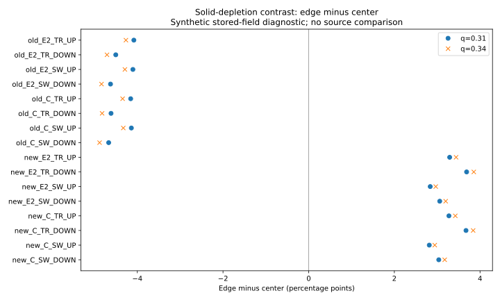
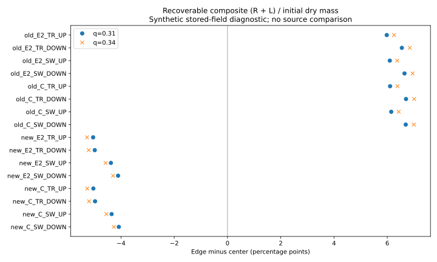
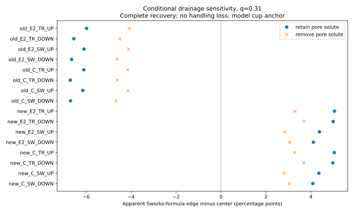

# SCI-MD-RADIAL-OBS-001 retained-field diagnostic

The assay identifies sheet-specific recoverable-solute composites. Solid depletion requires additional assumptions about retained pore solute, recovery, initial regional inventory and sample handling. The forward operator is CONDITIONAL; PHYSICAL_VALIDATION=NOT_ESTABLISHED.

Observed 16 retained base snapshots and 32 case/partition evaluations. Old E2 remains historical evidence. No new E2 accuracy or spatial-transfer qualification follows from these snapshots. No source-EWP fit, ranking or treatment-effect claim is made.

The source-inspired q=.31 and .34 values are explicit synthetic initial-mass cuts in the uniform cylinder. They are not measured cutter radii. Native oriented mesh volumes and annular overlap conserve inventories; cell averages remain constant through partial cells. E2 has unresolved structure within its annulus.

Table values are edge minus center, in percentage points of regional initial dry coffee. Composite is remaining solid plus retained dissolved solute. Apparent EY uses Sworks algebra under complete no-loss recovery, pore solute retained and synthetic LRR=0. No measured source anchor is used.

| Case | q | Solid depletion | Retained pore solute | Composite | Conditional apparent EY |
|---|---:|---:|---:|---:|---:|
| new_C_SW_WATER_ANCHORED_90C_DOWN_base | 0.31 | 3.036854 | -1.045634 | -4.082488 | 4.082488 |
| new_C_SW_WATER_ANCHORED_90C_DOWN_base | 0.34 | 3.175192 | -1.093330 | -4.268522 | 4.268522 |
| new_C_SW_WATER_ANCHORED_90C_UP_base | 0.31 | 2.815344 | -1.537382 | -4.352726 | 4.352726 |
| new_C_SW_WATER_ANCHORED_90C_UP_base | 0.34 | 2.943555 | -1.607387 | -4.550942 | 4.550942 |
| new_C_TR_LINEAR_DOWN_base | 0.31 | 3.672517 | -1.302072 | -4.974589 | 4.974589 |
| new_C_TR_LINEAR_DOWN_base | 0.34 | 3.839660 | -1.361370 | -5.201030 | 5.201030 |
| new_C_TR_LINEAR_UP_base | 0.31 | 3.273889 | -1.764384 | -5.038273 | 5.038273 |
| new_C_TR_LINEAR_UP_base | 0.34 | 3.422921 | -1.844663 | -5.267584 | 5.267584 |
| new_E2_SW_WATER_ANCHORED_90C_DOWN_base | 0.31 | 3.058999 | -1.051234 | -4.110233 | 4.110233 |
| new_E2_SW_WATER_ANCHORED_90C_DOWN_base | 0.34 | 3.198044 | -1.099018 | -4.297062 | 4.297062 |
| new_E2_SW_WATER_ANCHORED_90C_UP_base | 0.31 | 2.837376 | -1.541659 | -4.379035 | 4.379035 |
| new_E2_SW_WATER_ANCHORED_90C_UP_base | 0.34 | 2.966347 | -1.611735 | -4.578082 | 4.578082 |
| new_E2_TR_LINEAR_DOWN_base | 0.31 | 3.686788 | -1.299216 | -4.986004 | 4.986004 |
| new_E2_TR_LINEAR_DOWN_base | 0.34 | 3.854369 | -1.358271 | -5.212640 | 5.212640 |
| new_E2_TR_LINEAR_UP_base | 0.31 | 3.291079 | -1.755693 | -5.046772 | 5.046772 |
| new_E2_TR_LINEAR_UP_base | 0.34 | 3.440673 | -1.835497 | -5.276170 | 5.276170 |
| old_C_SW_WATER_ANCHORED_90C_DOWN_base | 0.31 | -4.669091 | 2.023938 | 6.693029 | -6.693029 |
| old_C_SW_WATER_ANCHORED_90C_DOWN_base | 0.34 | -4.881680 | 2.115998 | 6.997678 | -6.997678 |
| old_C_SW_WATER_ANCHORED_90C_UP_base | 0.31 | -4.139734 | 2.009817 | 6.149551 | -6.149551 |
| old_C_SW_WATER_ANCHORED_90C_UP_base | 0.34 | -4.328237 | 2.101078 | 6.429315 | -6.429315 |
| old_C_TR_LINEAR_DOWN_base | 0.31 | -4.614134 | 2.089821 | 6.703955 | -6.703955 |
| old_C_TR_LINEAR_DOWN_base | 0.34 | -4.822945 | 2.184362 | 7.007307 | -7.007307 |
| old_C_TR_LINEAR_UP_base | 0.31 | -4.155556 | 1.949919 | 6.105475 | -6.105475 |
| old_C_TR_LINEAR_UP_base | 0.34 | -4.344045 | 2.038042 | 6.382087 | -6.382087 |
| old_E2_SW_WATER_ANCHORED_90C_DOWN_base | 0.31 | -4.626096 | 2.020763 | 6.646859 | -6.646859 |
| old_E2_SW_WATER_ANCHORED_90C_DOWN_base | 0.34 | -4.836374 | 2.112615 | 6.948989 | -6.948989 |
| old_E2_SW_WATER_ANCHORED_90C_UP_base | 0.31 | -4.103782 | 1.991726 | 6.095508 | -6.095508 |
| old_E2_SW_WATER_ANCHORED_90C_UP_base | 0.34 | -4.290318 | 2.082259 | 6.372577 | -6.372577 |
| old_E2_TR_LINEAR_DOWN_base | 0.31 | -4.503611 | 2.044114 | 6.547725 | -6.547725 |
| old_E2_TR_LINEAR_DOWN_base | 0.34 | -4.708321 | 2.137028 | 6.845349 | -6.845349 |
| old_E2_TR_LINEAR_UP_base | 0.31 | -4.081236 | 1.899694 | 5.980929 | -5.980929 |
| old_E2_TR_LINEAR_UP_base | 0.34 | -4.266747 | 1.986043 | 6.252790 | -6.252790 |

Each region's masses, dry residue, recovery water/beverage, both workbook conventions, both pore-solute survival examples and matched C/E2 differences are in [RESULT.json](RESULT.json). Undefined source inputs are explicit. These extreme handling assumptions are sensitivity examples, not confidence intervals.

SOURCE_RECONSTRUCTION is reported by the linked Puckworks artifact. FORWARD_ASSAY_MAP=CONDITIONAL; IDENTIFIED_OBSERVABLE=sheet-specific corrected recoverable-solute contrast (see Puckworks measurement map); EWP_FIELD_DIAGNOSTIC=COMPLETE.

NEW_NATIVE_INTEGRATIONS=0; NEW_NATIVE_BUILDS=0; PRODUCTION_DEFAULTS_AND_LOCK=UNCHANGED. No source coffee/geometry/endpoint/pressure match; no new physical validation, production adoption or successor.
