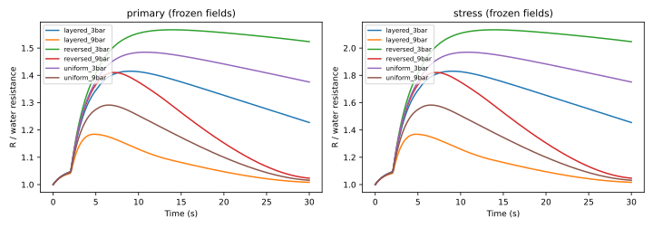
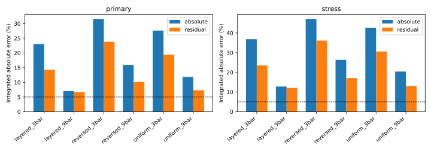

# SCI-MD-RHEOLOGY-001 result

**Scientific result: STATE_DEPENDENT_EFFECT. Execution: IMPLEMENTED_AND_EXECUTED.**

Under this saturated EWP screen, concentration-dependent viscosity produces
material time, pressure-condition and layer-location dependence after one constant
conductance rescaling. The largest primary residual is **23.81% integrated and
27.62% peak**, versus owner-selected 5%/10% thresholds. Empirical numerical
uncertainty estimates are **0.102 and 0.107
percentage points**, respectively, below the 0.5-point target. The primary
result already meets materiality; it is not stress-dependent.

This supports a small coupled follow-on test. It does not physically qualify
fresh-espresso viscosity: the source is one industrial soluble-extract batch,
and dilute cells use an explicitly assumed extension to water.

## What was new and what was reused

Puckworks G10 already used **local Cameron concentration profiles**, with
uniform-permeability depth averaging and a dilute extension. Its recorded small
integrated effect did not bound EWP aggregate-solute states, layer resistance
weighting, or residual error after a reference-only factor. SCI-MD-010/011/012
and the completed private Visualizer programme addressed other questions.
Their conclusions were neither reopened nor used as calibration targets.

This task executed six new unchanged-EWP, fully saturated, 30-second Darcy
runs: uniform, verified axial layers and their reversal, each at 3 and 9 bar
puck-face pressure difference, fixed 90 C. The six numerical checks separately
refined time/sampling and axial resolution for uniform_9bar, layered_3bar and
reversed_3bar. **12/12 solver invocations completed; zero concentration fields
were reused as separately executed runs.** Existing source loaders, verified
case machinery and the layered discrete hydraulic reference were reused.

All scenarios have the same geometry, aggregate inventory and kinetics, and
matching continuum water-only series resistance. Permeabilities are synthetic
scenario inputs. The concentration adapter uses EWP's accounting-consistent
w=c/(965+c), and rejects incomplete indexed-species inventories. No new fit to
experimental observations was performed.

## Absolute and fixed-scale effects

For the primary property treatment, alpha is **0.88168341**, determined
only by uniform_9bar over 0–30 s. It is held fixed across every time and scenario.
Errors below are percentages; integrated errors use the integral of the absolute
difference, so cancellation cannot hide transients.

| Scenario | Absolute integrated | Absolute peak | Fixed-scale integrated | Fixed-scale peak |
|---|---:|---:|---:|---:|
| layered_3bar | 23.05 | 29.34 | 14.26 | 19.86 |
| layered_9bar | 7.04 | 15.57 | 6.64 | 13.42 |
| reversed_3bar | 31.50 | 36.18 | 23.81 | 27.62 |
| reversed_9bar | 15.95 | 29.11 | 10.12 | 19.59 |
| uniform_3bar | 27.60 | 32.65 | 19.41 | 23.61 |
| uniform_9bar | 11.83 | 22.55 | 7.33 | 13.42 |

Time dependence alone survives in the reference: 7.33% integrated residual.
At 3 bar, moving the low-permeability layer from upstream to downstream raises
integrated residual from 14.26% to 23.81%, a **9.55-point** change despite equal
water-only series resistance. At 9 bar the corresponding increase is 3.48 points.
The highest residual is reversed_3bar, selected by the frozen rule for refinement.

The doubled-excess **modelling stress** treatment has alpha
**0.79588255**. Its worst absolute errors are **47.00% / 53.14%**
(integrated / peak), and worst residuals **36.16% / 41.12%**, again reversed_3bar.
Numerical estimates are **0.115 / 0.119 points**.
It also yields STATE_DEPENDENT_EFFECT. It is not an independent dataset,
confidence interval or experimentally established uncertainty bound.

## Source support and numerical qualification

Local concentration spans 0–179.987 kg/m3 (0–15.720% solids by mass). All non-dilute
cells stay within the source's 10–24% Newtonian solids domain at 363.15 K; no
unsupported concentration gap, concentrated regime or temperature clamping occurs.
The resistance-weighted mean viscosity spans 0.312674–0.489941 mPa.s for primary,
and up to 0.667208 mPa.s for stress.

Dilute extension occupancy and its share of **total hydraulic resistance** vary
with time. The following ranges cover the saved 0.1–30 s fields; t=0 is exactly
pure water. Measured-domain contributions are the complements. Cell percentages
alone would misstate the contribution of layers carrying different resistance.

| Scenario | Dilute cells (%) | Dilute resistance contribution (%) |
|---|---:|---:|
| layered_3bar | 8.01–100 | 10.87–100 |
| layered_9bar | 23.05–100 | 34.29–100 |
| reversed_3bar | 8.01–100 | 2.64–100 |
| reversed_9bar | 23.05–100 | 8.07–100 |
| uniform_3bar | 7.81–100 | 6.70–100 |
| uniform_9bar | 23.05–100 | 20.89–100 |

The reference-only alpha also depends on this extension. None of these
contributions qualifies the transfer from industrial extract to fresh espresso.
The independent audit found and corrected a pre-execution numerical mismatch:
EWP's existing arithmetic face interpolation differs from the continuum series
integral at a layer interface. The scientific integral was preserved. All runs
pass the exact discrete-flow check at 1e-6 relative tolerance; primary maximum
observed discrepancy is 1.51e-11.
The continuum-versus-solver discrepancy is at most
0.07036% on the primary mesh,
and is included in both reported numerical allowances.

The estimates add temporal, spatial, sampling and continuum hydraulic terms,
including propagation of reference-alpha changes across the other cases.
[NUMERICAL.json](NUMERICAL.json) retains each term and the .05-versus-.1 s peak
comparison. These are empirical resolution estimates, not statistical intervals
or rigorous PDE error bounds; the spatial check also changes Courant number.
No reported classification is near a materiality threshold. All 12 runs remain
saturated; worst water/solute balance residuals are 1.08e-12 / 2.18e-12 kg.

## Implementation, tests and reproduction

G1, SOURCE_SCENARIO_CHANGE_ONLY. The independent AI pre-result audit passed the
exact amended freeze before execution; [AUDIT.md](AUDIT.md) preserves the initial
FAIL and its resolution. [AUTHORITY.json](AUTHORITY.json) freezes source/build
identities and rights; [MANIFEST.json](MANIFEST.json) binds execution and artifacts.
Analysis Puckworks is pinned separately at 2058d0e947ee9eb92c52d64f6165b810f1fb4732.
The production runtime lock remains fc61c4670ec7bf801e40bb391aab16048b8da26b.

Actual commands: unchanged-source wmake; the primary runner; temporal/spatial
runner calls for the three declared representatives; analyze; report. The exact
CLI recipe is in [PROTOCOL.md](PROTOCOL.md). To reproduce, set explicit external
PUCKWORKS, RUNS, AUDIT, EXE and OUTPUT paths and use that recipe. No archival
Allrun/Allverify/Allclean workflow was executed.

Checks passed: 23 focused synthetic tests; all 24 authoritative measured-grid
points (no table exported); full repository run of 1,436 tests with seven skips;
39 static gates; historical-baseline integrity; active governing-change boundary;
source integrity, shell syntax and path/secret/generated-product checks.
[QA.json](QA.json) records the earlier packaging/environment failures and passing
rechecks separately. Five audit-amendment tests passed in the focused run after
full-suite discovery. Figures and metric summaries are compact derived outputs;
58,968 raw files, meshes, logs and executable remain outside Git.

## Decision and unchanged scope

**Recommendation:** separately authorize the smallest coupled test on the
uniform_9bar reference and reversed_3bar high-residual case, feeding this same
aggregate-solute viscosity treatment into saturated Darcy flow while retaining
static geometry/permeability, fixed temperature, mass accounting and the same
reference-only comparison. Its purpose would be to measure how transport feedback
changes this screen's result. No such follow-on is implemented or authorized here.

Production solver, governing equations, defaults, runtime lock and immutable
baseline evidence remain unchanged. Q_mu is a response to concentration fields
held fixed; its integral is not a predicted cup mass. No corrected extraction
yield, first-drip shift, Visualizer explanation, E2C conclusion or physical
validation is claimed.
