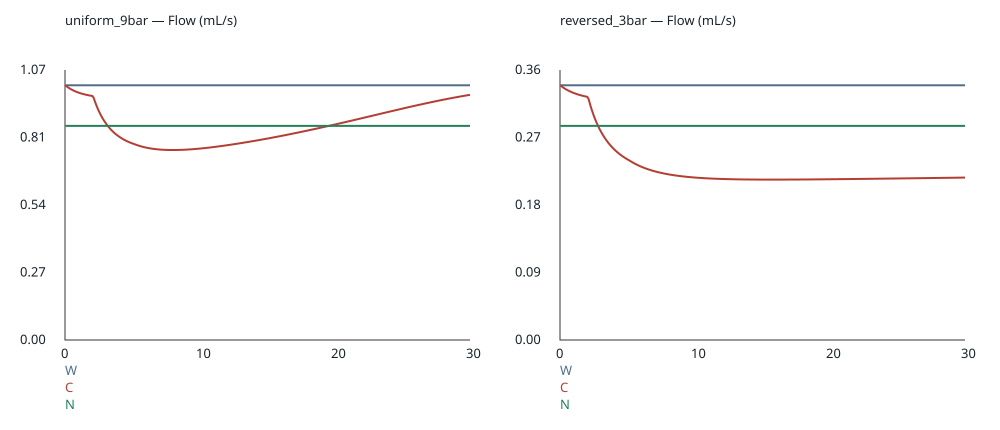
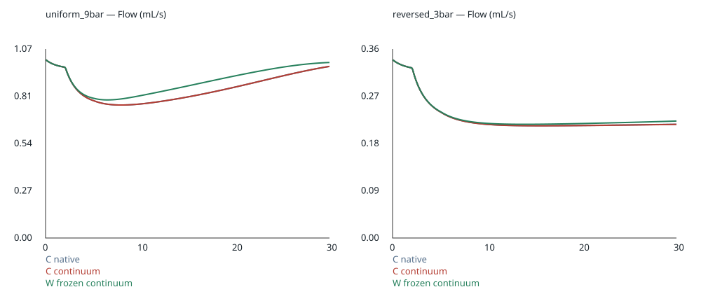
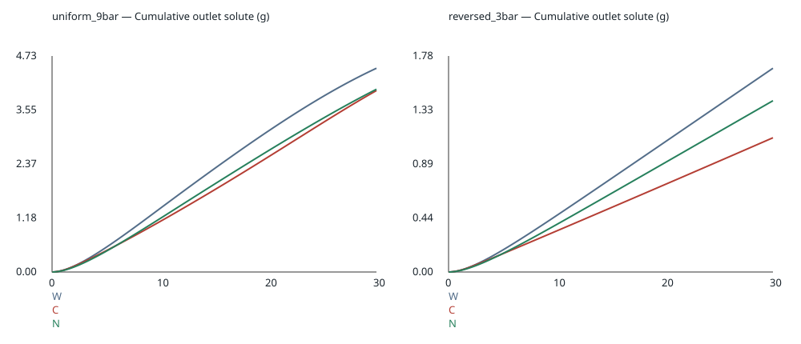

# SCI-MD-RHEOLOGY-002 result

**COUPLED_STATE_DEPENDENCE_PERSISTS. IMPLEMENTED_AND_EXECUTED.**
Both conditions have numerically qualified material C-versus-N residuals.
Local viscosity changes native Darcy flux, which changes the aggregate solute
state used on the next step. A single reference-volume conductance adjustment
does not reproduce the resulting hydraulic histories. This supports retaining
the experimental option for further qualified work, not default adoption.
Industrial-extract transfer and the assumed dilute extension remain limitations;
physical espresso validation is not established.

## Primary decision

Base alpha_002 = **0.8406087210339453**, computed solely from native 0–30 s
reference C/W outlet volumes. N independently solves pressure and transport
with mu_water/alpha; permeability and transport inputs are unchanged.

| Condition | C/W integrated | C/W peak | C/N integrated | C/N peak | Condition class |
|---|---:|---:|---:|---:|---|
| uniform_9bar | 15.9391% | 25.4156% | 7.8966% | 18.9614% | COUPLED_STATE_DEPENDENCE_PERSISTS |
| reversed_3bar | 32.3405% | 37.0281% | 21.9611% | 25.0878% | COUPLED_STATE_DEPENDENCE_PERSISTS |

Thresholds remain 5% integrated OR 10% peak. Peak C/N reference error includes
the first physical interval: C begins at water viscosity while N already has
its calibrated lower conductance. Nothing is trimmed. Reference C/N cumulative
water equality is calibration by construction; their flow histories differ.
Maximum Q_N/(alpha*Q_W) departure across all six comparisons is 1.004e-11
relative, against 1e-6. The predecessor alpha was not reused.

## Numerical qualification

All 18 authorized full runs completed: 6 base, 6 half-dt, 6 refined axial mesh.
There were no full-run failures or repeats. Every primary metric uses every
native physical interval, with complete [0,30] coverage and matched treatment
grids. Interval volume equals Q*dt; initialization contributes no fake zero.

| Condition/comparison | Time estimate, int/peak (pp) | Space estimate, int/peak (pp) | Operator allowance (pp) | Total, int/peak (pp) |
|---|---:|---:|---:|---:|
| uniform C/W | 0.00465 / 0.00426 | 0.00687 / 0.01655 | 0.0000417 | 0.01157 / 0.02085 |
| uniform C/N | 0.00094 / 0.00658 | 0.00924 / 0.00973 | 0.0000496 | 0.01022 / 0.01636 |
| reversed C/W | 0.00432 / 0.00101 | 0.00454 / 0.00454 | 0.0703125 | 0.07917 / 0.07586 |
| reversed C/N | 0.00844 / 0.00535 | 0.00023 / 0.00072 | 0.0836516 | 0.09232 / 0.08972 |

pp means percentage points. All are below the 0.5 pp target and cannot change
the classification. Time and space are isolated changes; estimates are sums of
absolute two-level differences and the prospectively retained operator term,
not rigorous PDE bounds or statistical intervals. Quadrature/sampling allowance
is zero for the discrete interval trajectories; there is no sparse-field
integration. Every refinement peak retains all intervals. Plot thinning does
not enter metrics. Continuous-time uncertainty is represented by dt refinement.

Alpha is 0.840562193542064 (half dt), 0.8405400040035043 (double axial cells).
Its maximum change is 0.0000687170. Applying those alpha changes alone to base
transfer outputs changes C/N integrated/peak by at most 0.00485/0.00612 pp.
This is reported separately and not added again to set-wise refinement changes.

Maximum C pore Courant is 1.08884 / 0.47216 in reference/transfer at base,
0.54442 / 0.23608 at half dt, and 2.17767 / 0.94399 at double axial resolution
with base dt. The transport discretization is unchanged. Axial cell-volume
checks recover 0.009011660896432553 m depth and 0.0026420794216690164 m2 full
area, with sector scale 72.09146648398465. Final scalar radial invariance passes
the inherited reduction check; checked whole-run radial/axial velocity ratios
are <=7.93e-10. Porosity remains 0.4 and saturation 1.

Worst native water/total-solute balance residuals across all intervals and sets
are 1.420e-12 / 2.181e-12 kg, versus 1e-8 kg gates. Normalized maxima are
1.383e-10 of final outlet water and 3.895e-10 of initial 0.0056 kg solute inventory.
Existing boundedness correction mass is exactly zero in every scientific run.
Concentration spans 0–179.99553 kg/m3; no negative-state or source-domain failure
occurred. Stored dissolved mass uses pore volume, remaining inventory bulk
volume; inlet back diffusion is included in the solute balance.

## Feedback versus the frozen-field screen

The companion uses W's own c^n from these runs, through the same local property
and continuum resistance formula as C. It is recorded on the identical physical
interval, not inferred from a final field or outlet average. Thus state-time and
sampling mismatch in this decomposition are zero.

| Condition | Frozen W continuum suppression, int/peak | Coupled native suppression, int/peak | Signed feedback volume / W volume | Max native/continuum operator difference / W |
|---|---:|---:|---:|---:|
| uniform_9bar | 11.8311% / 22.5533% | 15.9391% / 25.4156% | -4.1081% | 0.0000417% |
| reversed_3bar | 31.5358% / 36.2262% | 32.3405% / 37.0281% | -0.8534% | 0.0703125% |

Feedback amplifies the integrated suppression in both conditions. It also
reshapes the history: maximum common-continuum feedback departures are 6.4067%
and 1.8755% of W flow. These are distinct from the operator discrepancy.
Native conservative flux remains primary. Layered constant-table fixtures
approach continuum with refinement (1.1378% at 32 cells, 0.5657% at 64); the
inherited arithmetic face interpolation is unchanged. Pressure and layer
structure change together between conditions, so neither is separately identified.

## Model transport consequences (base runs)

| Condition | Treatment | Water (g) | Outlet solute (g) | Beverage (g) | Cumulative TDS (%) | Remaining (g) | Stored dissolved (g) |
|---|---|---:|---:|---:|---:|---:|---:|
| uniform_9bar | W | 29.3171 | 4.46488 | 33.7820 | 13.2167 | 0.816574 | 0.317331 |
| uniform_9bar | C | 24.6442 | 3.97561 | 28.6199 | 13.8911 | 1.188041 | 0.434908 |
| uniform_9bar | N | 24.6442 | 4.00438 | 28.6486 | 13.9776 | 1.134790 | 0.459395 |
| reversed_3bar | W | 9.77926 | 1.67729 | 11.4565 | 14.6404 | 2.732018 | 1.187355 |
| reversed_3bar | C | 6.61660 | 1.10502 | 7.72162 | 14.3107 | 3.121245 | 1.369438 |
| reversed_3bar | N | 8.22053 | 1.40995 | 9.63048 | 14.6405 | 2.914764 | 1.271395 |

Reference C delivers 0.02877 g less solute than N despite matching water volume;
transfer C delivers 0.30493 g less than N. No transport-equivalence threshold
was fitted or claimed. C solute-delivery refinement changes are <=0.00104 g
(reference) and <=0.00048 g (transfer). Instantaneous TDS uses instantaneous
solute/(water+solute) mass rates; cumulative TDS uses accumulated outlet masses.
C instantaneous TDS ranges are 0.1825–15.5252% and 0.1825–15.7202%. These are
model outlet quantities, not validated physical cup outcomes.

C inlet diffusive losses are 1.439e-6 / 4.296e-6 kg in reference/transfer. Native
inlet/outlet advective accounting uses the pressure equation flux; the zero
inlet concentration and zero-gradient outlet leave no unaccounted solute inlet
or outlet diffusive source in these cases. METRICS.json retains all treatments.

C local viscosity spans 0.312674–0.504649 / 0.511730 mPa.s. All evaluated solids
fractions remain within [0,0.24]; the maximum is about 0.157202. The dilute
extension's resistance share ranges from 18.3902–100% / 2.0941–100%, and volume
occupancy from 22.0703–100% / 7.4219–100%. The t=0 water anchor is included.
In W/N, METRICS.json's `mu_range_Pa_s` describes the *hypothetical local table
viscosity used for the frozen diagnostic*, not their applied constant hydraulic
viscosity. W applies 0.31267394194924405 mPa.s; N applies that value divided by
alpha. Coupling does not remove the industrial-extract or dilute assumptions.

## Implementation, evidence and corrections

The optional native helper and maintained case generator implement lagged
beginning-of-step coupling. Off/absent defaults need no table or source checkout.
Fresh saturated static aggregate Darcy modes are enforced in Python and native
startup; unsupported restart is rejected. No dependency lock or global face
interpolation changed. The shared compiled evaluator agrees with the accepted
adapter to 1.333e-15 relative over 24,011 fixed points (gate 1e-4).

The first short synthetic verification exposed calculated viscosity patches
remaining at water values. This was corrected before the prospective freeze by
using permeability patch types. Six completed one-second fixtures in that first
attempt are retained with the failed multiplier assertion. A subsequent 18-run
short suite passed; after adding final-state extrema and Courant diagnostics,
18 final one-second fixtures passed again. One 0.2 s development smoke and seven
intentional native startup rejection fixtures are separate from the full-run
budget. No scientific run was used to repair this defect or choose tolerances.

Final native verification: absent/disabled traces equal the accepted predecessor
executable exactly on both short scenarios; constant synthetic table recovery,
water/zero source, evolving feedback, multiplier, uniform/layer analytical,
continuum approach, conservation, repeat and two-rank checks pass. Maximum
analytical relative error is 5.40e-12; serial/MPI normalized maximum 1.41e-11;
repeat difference zero. Baseline executable SHA-256 is independently tied to
predecessor AUTHORITY.json. No predecessor field was relabeled as a new run.

Historical source checks now bind unchanged historical XSV evidence to the
accepted predecessor bytes, while checking current production bytes against
this task's frozen contract. Historical rheology execution still rejects the
changed solver. The original predecessor protocol, freeze, source audit,
amendments and results remain byte-identical. These are packaging/CI boundary
repairs, not a new scientific audit or a change to frozen mathematics.

FREEZE.json is the original pre-result freeze at commit 3a10fa1. RUNS.json binds
all invocations, configurations, runtime inputs and logs without exposing local
paths. EXPORT.json, VERIFICATION.json and STARTUP.json retain compact evidence.
All raw fields, meshes, logs, binaries and source-derived tables are external.
Final Python/static/hosted CI and exact-head review status are reported in the
PR handoff; a scientific classification is not a substitute for those checks.

Recommendation: **retain the experimental option for further qualified work**.
Keep constant viscosity as the default. No automatic successor or merge.

## Reproduction

Source Foundation OpenFOAM 12; use explicit external artifact paths. Build with
`FOAM_USER_APPBIN` set to an external bin directory and `wmake solver/espressoWholePullFoam`.
Compile `tools/sci_md_rheology_002/evaluator.cpp` with a C++11-or-later compiler.
Run module CLIs using `python3 -m tools.sci_md_rheology_002.{export,verify,run,analyze}`;
`--help` documents required external source/table/executable/artifact arguments.
`run` checks the original freeze and refuses existing/failed/full-budget repeats.
`analyze` reproduces METRICS.json and the three SVGs from per-step records.
`evidence` packages identities and geometry after native writeCellCentres and
writeCellVolumes on the declared checked cases. Final acceptance includes the
complete unittest discovery suite, source/static/baseline/change-boundary checks,
shell/JSON and secret/path checks, required hosted CI and independent review.
