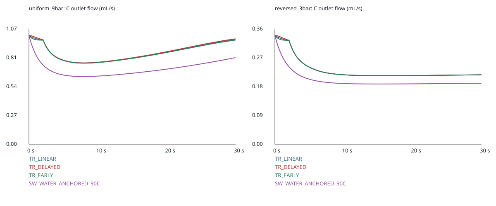
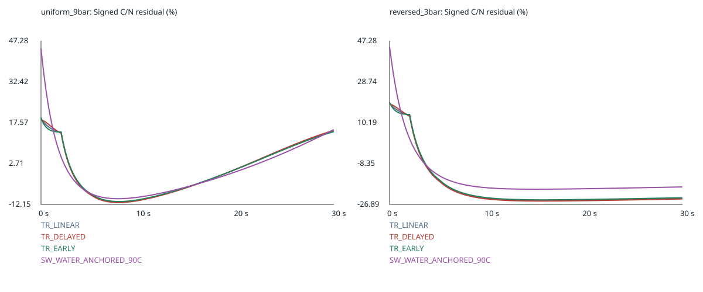
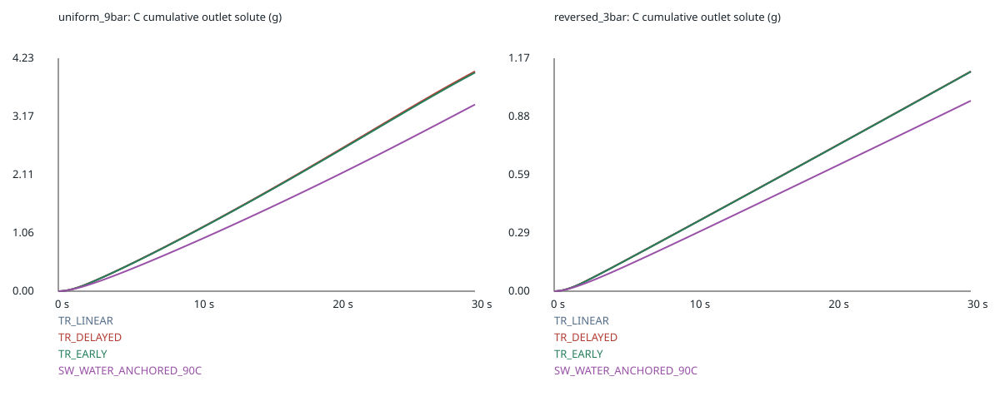

# SCI-MD-RHEOLOGY-003 result

**ROBUST_ACROSS_TESTED_VISCOSITY_LAWS**.

The failure of one reference-calibrated constant-viscosity hydraulic scale survives all four declared laws in both conditions. Both TR continuation stresses preserve the decision, and the separately labelled Sobolik/Weisser source-shape stress preserves it. This finite family is not measured uncertainty, a bound on every plausible law, a source ranking, or fresh-espresso validation.

Implementation and execution: **IMPLEMENTED_AND_EXECUTED**. Exactly 24/24 new full coupled attempts completed, with zero failures, plus four separately recorded short invariant checks. The 18 predecessor W/C/N runs are reused by verified hashes; baseline metric reproduction is exact. No production solver, interface, transport, boundary, default, or runtime-lock change.

Independent pre-scoring audit: PASS ([receipt](AUDIT.json)). Final result review and hosted CI are separate statuses reported on [PR #154](https://github.com/trbrewer/espresso-whole-pull/pull/154). Merge is not authorized.

## Hydraulic effects

Values below are percent; ± is the total empirical numerical estimate in percentage points, not a confidence interval. Both comparisons are qualified **material** for every row. Metrics use every native interval from zero to 30 seconds, including the first interval.

| Law | Condition | C/W E_int ± u | C/W E_peak ± u | C/N E_int ± u | C/N E_peak ± u |
|---|---|---:|---:|---:|---:|
| SW_WATER_ANCHORED_90C | reversed_3bar | 41.44863 ± 0.07134 | 44.67487 ± 0.07225 | 18.07078 ± 0.11952 | 44.60238 ± 0.12236 |
| SW_WATER_ANCHORED_90C | uniform_9bar | 30.84485 ± 0.00993 | 37.81125 ± 0.00300 | 7.58178 ± 0.01244 | 44.60238 ± 0.02074 |
| TR_DELAYED | reversed_3bar | 32.27375 ± 0.07938 | 37.01265 ± 0.07592 | 22.24480 ± 0.09167 | 25.37232 ± 0.08949 |
| TR_DELAYED | uniform_9bar | 15.59788 ± 0.01179 | 25.26875 ± 0.02116 | 8.03669 ± 0.01045 | 18.48043 ± 0.01654 |
| TR_EARLY | reversed_3bar | 32.40625 ± 0.07897 | 37.04359 ± 0.07580 | 21.68086 ± 0.09303 | 24.80580 ± 0.09002 |
| TR_EARLY | uniform_9bar | 16.27492 ± 0.01141 | 25.56135 ± 0.02054 | 7.75909 ± 0.01006 | 19.43853 ± 0.01626 |
| TR_LINEAR | reversed_3bar | 32.34049 ± 0.07917 | 37.02813 ± 0.07586 | 21.96112 ± 0.09232 | 25.08777 ± 0.08972 |
| TR_LINEAR | uniform_9bar | 15.93913 ± 0.01157 | 25.41564 ± 0.02085 | 7.89660 ± 0.01022 | 18.96141 ± 0.01636 |

Materiality is E_int ≥5% or E_peak ≥10%, applied to E−u. All numerical estimates meet the 0.5 percentage-point target. Detailed per-condition qualifications and every numerical term are in [METRICS.json](METRICS.json). Reference cumulative-volume equality is calibration, not validation. Algebraic N supplies hydraulics only; no N transport output is produced.

## Calibration and numerical terms

| Law | Base alpha | Temporal alpha | Spatial alpha | Property alpha |
|---|---:|---:|---:|---:|
| SW_WATER_ANCHORED_90C | 0.691551536849 | 0.691515521293 | 0.691612499548 | 0.691553455374 |
| TR_DELAYED | 0.844021242693 | 0.843975454042 | 0.843949834627 | 0.844021535064 |
| TR_EARLY | 0.837250790856 | 0.837203528186 | 0.837184700611 | 0.837250507563 |
| TR_LINEAR | 0.840608721034 | 0.840562193542 | 0.840540004004 | exact linear table; reused |

mu_N=mu_water/alpha; exact values are retained in METRICS.json. Each new law and set calibrates only on uniform_9bar. Property runs use base W. Alpha-only propagation diagnostics are reported separately and are not added twice.

Maximum individual uncertainty terms across the two conditions and both metrics/comparisons, in percentage points (maxima need not occur in the same row):

| Law | Temporal | Spatial | Property table | Native/continuum allowance | Total maximum |
|---|---:|---:|---:|---:|---:|
| SW_WATER_ANCHORED_90C | 0.011086 | 0.012746 | 0.000401 | 0.101679 | 0.122357 |
| TR_DELAYED | 0.008245 | 0.016811 | 0.000041 | 0.083314 | 0.091672 |
| TR_EARLY | 0.008652 | 0.016292 | 0.000040 | 0.083987 | 0.093027 |
| TR_LINEAR | 0.008441 | 0.016554 | 0.000000 | 0.083652 | 0.092321 |

These estimates sum absolute temporal, spatial, property-table changes and the inherited operator allowance with the appropriate W/N normalization. The exact piecewise-constant discrete-interval quadrature term is zero; temporal refinement addresses continuous-time discretization. Neither property approximation nor these empirical estimates is a rigorous PDE/output error bound.

## Effect-size spread from TR_LINEAR

Base matched-grid C_new versus C_TR_LINEAR, using TR_LINEAR flow as denominator; this does not rank physical accuracy. All refinement-set contrasts are also retained in METRICS.json.

| Law | Condition | Integrated difference (%) | Peak difference (%) |
|---|---|---:|---:|
| SW_WATER_ANCHORED_90C | reversed_3bar | 13.46173 | 25.49539 |
| SW_WATER_ANCHORED_90C | uniform_9bar | 17.73205 | 24.08105 |
| TR_DELAYED | reversed_3bar | 0.09865 | 1.20171 |
| TR_DELAYED | uniform_9bar | 0.40596 | 1.17963 |
| TR_EARLY | reversed_3bar | 0.09718 | 1.17357 |
| TR_EARLY | uniform_9bar | 0.39946 | 1.15298 |

## Local states and source interpretation

Base-run local extrema include initial and accepted next states; viscosity is applied C hydraulic viscosity.

| Law | Condition | w range | mu range (mPa.s) | w<0.10 volume (%) | w<0.10 resistance (%) |
|---|---|---:|---:|---:|---:|
| SW_WATER_ANCHORED_90C | reversed_3bar | 0.00000–0.15720 | 0.31267–0.57843 | 5.85937–100.00000 | 1.71887–100.00000 |
| SW_WATER_ANCHORED_90C | uniform_9bar | 0.00000–0.15638 | 0.31267–0.57597 | 17.96875–100.00000 | 14.19816–100.00000 |
| TR_DELAYED | reversed_3bar | 0.00000–0.15720 | 0.31267–0.51173 | 7.42187–100.00000 | 2.07805–100.00000 |
| TR_DELAYED | uniform_9bar | 0.00000–0.15523 | 0.31267–0.50457 | 22.26562–100.00000 | 18.31705–100.00000 |
| TR_EARLY | reversed_3bar | 0.00000–0.15720 | 0.31267–0.51173 | 7.42187–100.00000 | 2.10894–100.00000 |
| TR_EARLY | uniform_9bar | 0.00000–0.15527 | 0.31267–0.50473 | 22.07031–100.00000 | 18.46129–100.00000 |
| TR_LINEAR | reversed_3bar | 0.00000–0.15720 | 0.31267–0.51173 | 7.42187–100.00000 | 2.09408–100.00000 |
| TR_LINEAR | uniform_9bar | 0.00000–0.15525 | 0.31267–0.50465 | 22.07031–100.00000 | 18.39019–100.00000 |

TR laws use measured industrial-extract interpolation only over 0.10≤w≤0.24. Below 0.10, linear/delayed/early laws are deliberate continuations, not measured alternatives or confidence limits. EARLY/DELAYED exactly preserve the accepted measured segment.

SW_WATER_ANCHORED_90C is an **alternative source-derived concentration shape**, a **water-anchored model adaptation, not the literal published absolute law**. Eq5 is Sobolik’s fit to Weisser; the generated CSV and Weisser digitization are one lineage, not independent confirmations. The recorded Eq5 domain is about 0–80 C, so **90 C is a labelled temperature extrapolation across the entire evaluated curve**. Industrial/reconstituted-coffee material transfer remains unqualified; **not independent espresso validation**.

Accepted water viscosity is 0.00031267394194924405 Pa.s, raw Eq5 water at 90 C is 0.0003243585489046714 Pa.s, and the water-only normalization factor is 0.96397626332068265. No EWP output fits this factor.

All six tables pass ≤1e-4 property approximation, positivity, monotonicity (with declared floating-point roundoff tolerance) and native/Python equivalence. Eq5’s 486 in-domain CSV rows reproduce within 5e-9+1e-15 Pa.s decimal-rounding tolerance. Sources, endpoints, extrema and hashes are in [EXPORT.json](EXPORT.json) and source-use decisions in [SOURCE_USE.json](SOURCE_USE.json). No source table, digitization, paper, executable or full run is redistributed.

The native w<0.10 resistance diagnostic is not automatically a measured-data support fraction. In historical W/N observe mode, diagnostic table viscosity is not the applied constant hydraulic viscosity. Concentration remains c per pore-water volume and w=c/(965+c); no new density closure.

## Secondary coupled model outputs

Base C outputs only; no physical-validation or null-transport-equivalence claim. Masses are grams. Full remaining/stored inventory, inlet loss, TDS and Courant diagnostics are in METRICS.json.

| Law | Condition | Outlet water | Outlet solute | Model beverage | Cumulative TDS (%) |
|---|---|---:|---:|---:|---:|
| SW_WATER_ANCHORED_90C | reversed_3bar | 5.725889 | 0.958164 | 6.684052 | 14.335069 |
| SW_WATER_ANCHORED_90C | uniform_9bar | 20.274316 | 3.386257 | 23.660573 | 14.311812 |
| TR_DELAYED | reversed_3bar | 6.623125 | 1.105601 | 7.728726 | 14.305087 |
| TR_DELAYED | uniform_9bar | 24.744292 | 3.986526 | 28.730818 | 13.875435 |
| TR_EARLY | reversed_3bar | 6.610167 | 1.104447 | 7.714614 | 14.316294 |
| TR_EARLY | uniform_9bar | 24.545802 | 3.964788 | 28.510590 | 13.906370 |
| TR_LINEAR | reversed_3bar | 6.616598 | 1.105021 | 7.721618 | 14.310740 |
| TR_LINEAR | uniform_9bar | 24.644247 | 3.975612 | 28.619859 | 13.891096 |

All new runs pass inherited water/solute conservation, correction mass, concentration and inventory bounds, source domain, interval coverage and volume identity gates. See machine-readable per-run gates. Four short constant-viscosity checks agree with 0.5 times accepted W to maximum 1.04e-12 relative (limit 1e-6).

## Authority, reproduction and implication

Starting main: d40e0e64316d57dd4b685089daf07e3a13a11974, tree ebf8c0b78fda04f182ddae52968eab6002dbf768. Pre-scoring code: ea0e1169b29cd7d71761ea3b16a7d1a270878a8e. The immutable [freeze](FREEZE.json), [audit](AUDIT.json), [reuse receipt](REUSE.json) and [run index](RUNS.json) bind exact artifacts. Analysis source: 2058d0e947ee9eb92c52d64f6165b810f1fb4732. Runtime lock remains fc61c4670ec7bf801e40bb391aab16048b8da26b.

Historical science executable SHA256: 9e28686e567498de6d3f4bd2ba7b8e61872fef7b12f7daee4e2df6846b101139. New-run accepted parser-corrected executable: 9dea02fc3ba0a2858bd1efda6743c0feefffc5a1f863db3953bfb3d60efb5d43. Their identities are deliberately distinct; accepted 002 post-result amendment documents valid-table evidence reuse. No historical record was changed.

[Exact CLI instructions and external artifact requirements](README.md). The initial property-qualification roundoff check and pre-scoring implementation findings are preserved in the protocol/audit history. They caused no full native attempts and no scientific retuning.

**Model-development implication:** retain optional coupling for separately authorized development and close this specific finite-law robustness question. Magnitudes remain constitutive-law dependent. Do not infer universal robustness, tight physical uncertainty or fresh-espresso validity. No default adoption, merge, laboratory action or automatic successor is authorized.
