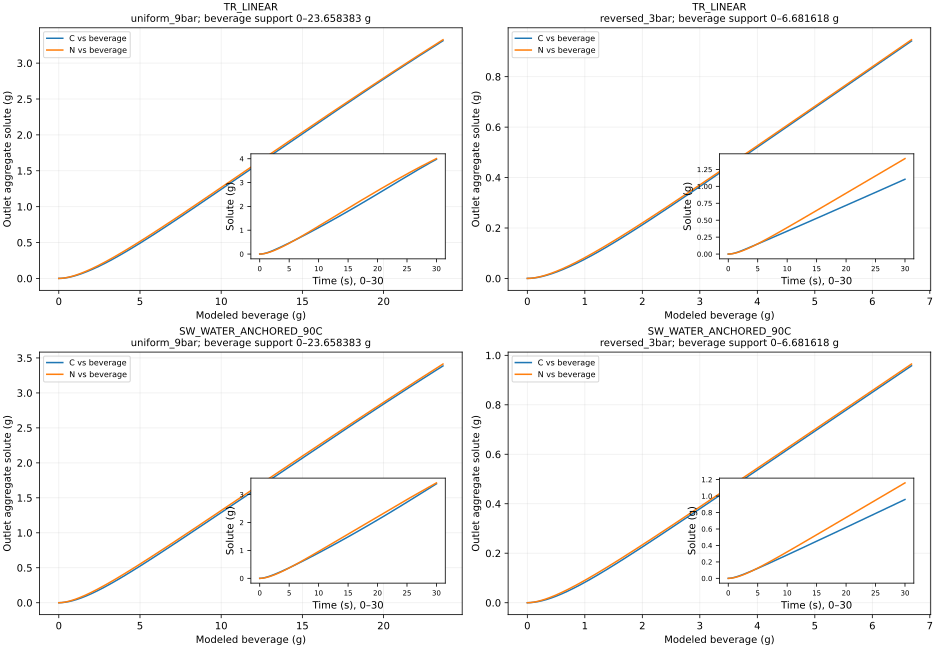
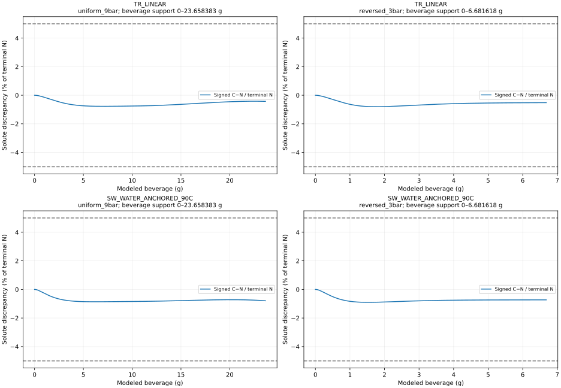
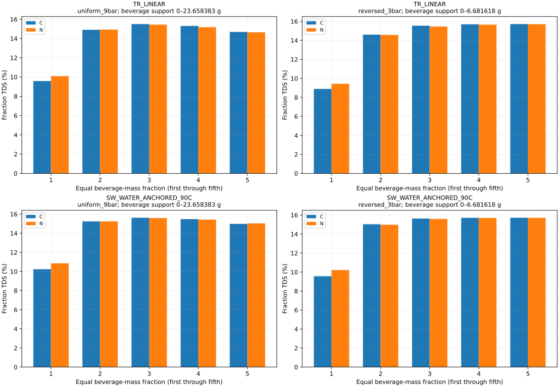
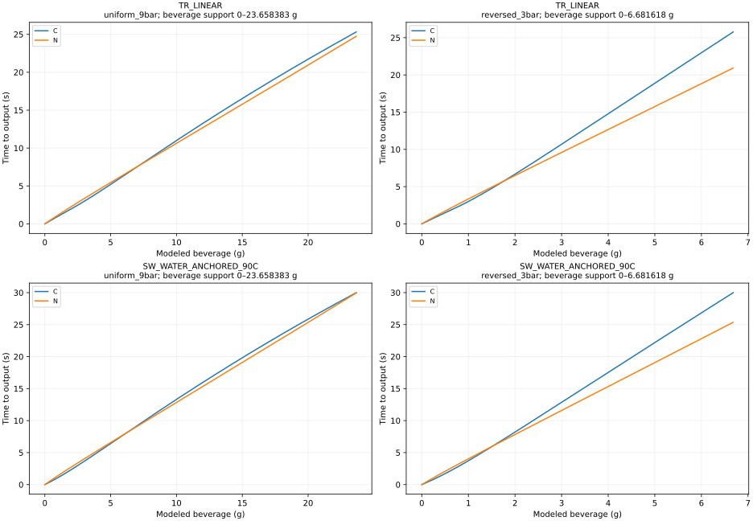

# SCI-MD-RHEOLOGY-004 result

**Local coupling remains material for fraction TDS at matched modeled beverage
mass in both laws and both scenarios. Cumulative solute delivery stays below
the separate 5% path threshold in every case.** The material classifications
come from the largest difference among five equal beverage-mass fractions:
0.510–0.647 percentage points against the declared 0.5-point threshold. These
are correlated views of aggregate solute, not independent confirmations.

Overall: **MASS_MATCHED_AGGREGATE_DELIVERY_MATERIAL**. This is a bounded
model-development result, not a claim of physical or taste significance.

## Primary C/N result on common beverage mass

C is native coupled viscosity; N independently evolves pressure, transport and
inventory at a constant viscosity calibrated only to reference 30 s water
volume. W is native water viscosity. All values below are base-set values on
the same support used by every refinement and both selected laws. Delta S is
signed C−N at the endpoint. E_path and its u are percent of N terminal solute;
TDS discrepancy and its u are percentage points (pp).

| Law / scenario | B support (g) | t C / N (s) | Delta S (g) | E_path ± u (%) | Max fraction TDS ± u (pp) | Class |
|---|---:|---:|---:|---:|---:|---|
| TR_LINEAR/uniform_9bar | 0–23.658382893 | 25.316160 / 24.751303 | -0.014239640 | 0.774764 ± 0.002439 | 0.509941 ± 0.001520 | MATERIAL |
| TR_LINEAR/reversed_3bar | 0–6.681617998 | 25.773302 / 20.929969 | -0.004902549 | 0.803397 ± 0.003040 | 0.537789 ± 0.001704 | MATERIAL |
| SW_WATER_ANCHORED_90C/uniform_9bar | 0–23.658382893 | 29.997592 / 29.957095 | -0.027123826 | 0.864012 ± 0.000850 | 0.612799 ± 0.000513 | MATERIAL |
| SW_WATER_ANCHORED_90C/reversed_3bar | 0–6.681617998 | 29.988768 / 25.359651 | -0.007044428 | 0.903905 ± 0.001111 | 0.647448 ± 0.000702 | MATERIAL |

Every E_path upper estimate is below 5%; every fraction-TDS lower estimate
reaches 0.5 pp. The closest case is TR_LINEAR/uniform_9bar: its lower
fraction-TDS estimate is 0.508421 pp. E_end is retained below and is contained
by E_path. The ± notation denotes an empirical two-level estimate, not a
statistical confidence interval or rigorous PDE bound.

**Decision consequence:** retain local coupling as relevant to mass-conditioned
aggregate fraction extraction in this tested regime. The small cumulative
delivery discrepancies alone would support deprioritizing rheology for that
observable, but they do not erase the qualified fraction-TDS result. Preserve
the established hydraulic classifications and optional coupling; no production
default adoption or automatic successor follows.

## Support and endpoint timing

B = native cumulative outlet water + aggregate solute under existing accounting.
It is modeled beverage mass, not validated scale mass, foam or downstream storage.
SUPPORT.json records coverage before discrepancy evaluation. The limiting
reference B arm is SW temporal C, and reference W is SW temporal N.
Both low-pressure endpoints are limited by SW spatial C. Required evidence
is complete: support is not provisional. Low-pressure support is only about
6.68 g beverage; no 36 g or 40 g extrapolation is made.

| Law / scenario | E_end (%) | t C−N (s) | t C/N | S C / N at B endpoint (g) |
|---|---:|---:|---:|---:|
| TR_LINEAR/uniform_9bar | 0.428156 | +0.564857 | 1.022821284 | 3.311568754 / 3.325808394 |
| TR_LINEAR/reversed_3bar | 0.518000 | +4.843334 | 1.231406631 | 0.941534896 / 0.946437445 |
| SW_WATER_ANCHORED_90C/uniform_9bar | 0.794706 | +0.040497 | 1.001351833 | 3.385938491 / 3.413062317 |
| SW_WATER_ANCHORED_90C/reversed_3bar | 0.730125 | +4.629118 | 1.182538692 | 0.957780862 / 0.964825290 |

Each arm's time to both common endpoints, including every refinement and W,
is retained in METRICS.json (`sets`, `B`/`W`, `C_N`/`C_W`).

## Secondary common-water diagnostic

This conditions prediction on specified water throughput, whereas the primary
view conditions on specified modeled beverage mass. Neither replaces a
prediction at specified time. Five equal-water fractions here are diagnostic;
the primary decision remains on five equal-beverage fractions. TDS always uses
solute divided by water plus solute.

| Law / scenario | W support (g) | t C / N (s) | Delta S (g) | E_end / E_path (%) | Max fraction TDS (pp) | Class |
|---|---:|---:|---:|---:|---:|---|
| TR_LINEAR/uniform_9bar | 0–20.273260201 | 25.233625 / 24.679099 | -0.016549291 | 0.499081 / 0.914754 | 0.552207 | MATERIAL |
| TR_LINEAR/reversed_3bar | 0–5.723803234 | 25.694613 / 20.888448 | -0.005817860 | 0.616092 / 0.940653 | 0.583235 | MATERIAL |
| SW_WATER_ANCHORED_90C/uniform_9bar | 0–20.273260201 | 29.998642 / 29.998438 | -0.031799462 | 0.930386 / 1.017001 | 0.666725 | MATERIAL |
| SW_WATER_ANCHORED_90C/reversed_3bar | 0–5.723803234 | 29.988583 / 25.390750 | -0.008358257 | 0.865125 / 1.056376 | 0.710904 | MATERIAL |

There is no classification disagreement between coordinate systems: water
E_path is qualified below and fraction TDS qualified material in all four
cases. Water-coordinate timing differences/ratios, fractions, cumulative TDS
and refinement estimates are retained separately in METRICS.json.

## Five equal beverage-mass fractions

All fractions, including the first physical interval, are retained. Fraction
TDS is delta S / delta B; cumulative TDS is S/B at the upper boundary.
Zero-mass TDS is undefined (`null` in the metrics), not zero.

| Law / scenario | Fraction | Fraction TDS C / N (%) | Cumulative TDS C / N (%) |
|---|---:|---:|---:|
| TR_LINEAR/uniform_9bar | 1 | 9.588995 / 10.098936 | 9.588995 / 10.098936 |
| TR_LINEAR/uniform_9bar | 2 | 14.905784 / 14.929783 | 12.247389 / 12.514360 |
| TR_LINEAR/uniform_9bar | 3 | 15.502474 / 15.436437 | 13.332417 / 13.488385 |
| TR_LINEAR/uniform_9bar | 4 | 15.305056 / 15.179435 | 13.825577 / 13.911148 |
| TR_LINEAR/uniform_9bar | 5 | 14.684908 / 14.643569 | 13.997443 / 14.057632 |
| TR_LINEAR/reversed_3bar | 1 | 8.894678 / 9.432467 | 8.894678 / 9.432467 |
| TR_LINEAR/reversed_3bar | 2 | 14.603011 / 14.576345 | 11.748844 / 12.004406 |
| TR_LINEAR/reversed_3bar | 3 | 15.548682 / 15.454535 | 13.015457 / 13.154449 |
| TR_LINEAR/reversed_3bar | 4 | 15.694258 / 15.655940 | 13.685157 / 13.779822 |
| TR_LINEAR/reversed_3bar | 5 | 15.716474 / 15.704684 | 14.091421 / 14.164794 |
| SW_WATER_ANCHORED_90C/uniform_9bar | 1 | 10.235864 / 10.848663 | 10.235864 / 10.848663 |
| SW_WATER_ANCHORED_90C/uniform_9bar | 2 | 15.244152 / 15.242079 | 12.740008 / 13.045371 |
| SW_WATER_ANCHORED_90C/uniform_9bar | 3 | 15.622306 / 15.586420 | 13.700774 / 13.892387 |
| SW_WATER_ANCHORED_90C/uniform_9bar | 4 | 15.477426 / 15.425145 | 14.144937 / 14.275577 |
| SW_WATER_ANCHORED_90C/uniform_9bar | 5 | 14.979211 / 15.029892 | 14.311792 / 14.426440 |
| SW_WATER_ANCHORED_90C/reversed_3bar | 1 | 9.564364 / 10.211812 | 9.564364 / 10.211812 |
| SW_WATER_ANCHORED_90C/reversed_3bar | 2 | 15.036982 / 14.982665 | 12.300673 / 12.597239 |
| SW_WATER_ANCHORED_90C/reversed_3bar | 3 | 15.640978 / 15.591889 | 13.414108 / 13.595455 |
| SW_WATER_ANCHORED_90C/reversed_3bar | 4 | 15.711107 / 15.697301 | 13.988358 / 14.120917 |
| SW_WATER_ANCHORED_90C/reversed_3bar | 5 | 15.719394 / 15.716306 | 14.334565 / 14.439995 |

## Fixed-time 30 s quantities (separate prediction)

These endpoint quantities are not matched-output comparisons. At low pressure,
much of the fixed-time solute difference accompanies a difference in delivered
amount; the matched-output analysis isolates a different question. Remaining
inventory, dissolved storage, inlet loss and local state diagnostics are also
retained for all numerical sets in METRICS.json.

| Law / scenario | Arm | Water (g) | Solute (g) | Beverage (g) | Cumulative TDS (%) |
|---|---|---:|---:|---:|---:|
| TR_LINEAR/uniform_9bar | C | 24.644247 | 3.975612 | 28.619859 | 13.891096 |
| TR_LINEAR/uniform_9bar | N | 24.644247 | 4.004383 | 28.648630 | 13.977573 |
| TR_LINEAR/uniform_9bar | W | 29.317144 | 4.464881 | 33.782025 | 13.216735 |
| TR_LINEAR/reversed_3bar | C | 6.616598 | 1.105021 | 7.721618 | 14.310740 |
| TR_LINEAR/reversed_3bar | N | 8.220529 | 1.409948 | 9.630477 | 14.640475 |
| TR_LINEAR/reversed_3bar | W | 9.779257 | 1.677287 | 11.456544 | 14.640427 |
| SW_WATER_ANCHORED_90C/uniform_9bar | C | 20.274316 | 3.386257 | 23.660573 | 14.311812 |
| SW_WATER_ANCHORED_90C/uniform_9bar | N | 20.274316 | 3.418059 | 23.692375 | 14.426830 |
| SW_WATER_ANCHORED_90C/uniform_9bar | W | 29.317144 | 4.464881 | 33.782025 | 13.216735 |
| SW_WATER_ANCHORED_90C/reversed_3bar | C | 5.725889 | 0.958164 | 6.684052 | 14.335069 |
| SW_WATER_ANCHORED_90C/reversed_3bar | N | 6.762860 | 1.159935 | 7.922795 | 14.640476 |
| SW_WATER_ANCHORED_90C/reversed_3bar | W | 9.779257 | 1.677287 | 11.456544 | 14.640427 |

## Numerical qualification

u = |temporal−base| + |spatial−base| + |property−base|, on identical common
support. The measured observer arithmetic discrepancy is added separately.
Targets are u <= 0.005 for relative E_path and <= 0.05 pp for fraction TDS.
Set-specific reference alpha includes its refinement effect once. TR's accepted
piecewise-linear table represents the law exactly, so its property term is zero;
no invented TR property run. SW property N is a separate native execution with
its property alpha and refined observer table.

| Law / scenario | Metric (units) | Temporal | Spatial | Property | Observer | Total u |
|---|---|---:|---:|---:|---:|---:|
| TR_LINEAR/uniform_9bar | E_path (relative) | 2.36295806e-05 | 7.63782251e-07 | 0 | 1.13e-17 | 2.43933629e-05 |
| TR_LINEAR/uniform_9bar | max_fraction_TDS_pp (pp) | 0.00136407257 | 0.000155509573 | 0 | 1.55e-15 | 0.00151958214 |
| TR_LINEAR/reversed_3bar | E_path (relative) | 2.91461811e-05 | 1.25300224e-06 | 0 | 1.21e-17 | 3.03991833e-05 |
| TR_LINEAR/reversed_3bar | max_fraction_TDS_pp (pp) | 0.00153358167 | 0.000170786121 | 0 | 2e-15 | 0.00170436779 |
| SW_WATER_ANCHORED_90C/uniform_9bar | E_path (relative) | 2.18622037e-07 | 8.25129657e-06 | 3.43816479e-08 | 1.04e-17 | 8.50430025e-06 |
| SW_WATER_ANCHORED_90C/uniform_9bar | max_fraction_TDS_pp (pp) | 9.90346882e-05 | 0.000411211014 | 2.56458067e-06 | 5.55e-16 | 0.000512810283 |
| SW_WATER_ANCHORED_90C/reversed_3bar | E_path (relative) | 1.67054489e-06 | 9.40327457e-06 | 3.88314011e-08 | 1.39e-17 | 1.11126509e-05 |
| SW_WATER_ANCHORED_90C/reversed_3bar | max_fraction_TDS_pp (pp) | 0.000110951614 | 0.000588215776 | 2.89755792e-06 | 1.55e-15 | 0.000702064948 |

All required intervals pass coverage, finite-state, source-domain, conservation,
concentration/inventory and correction gates. Maximum water/solute balance
residuals are 3.05e-12 / 2.18e-12 kg
(limit 1e-8 kg); correction mass is zero. Maximum native N departure from
alpha times matching W flow is 1.08e-11
(limit 1e-6). This qualifies hydraulics only. Maximum water-increment mismatch
from rho Q dt is 1.73e-18 kg (tolerance 1e-14 kg).

The observer conservatively splits W, S and time by the same interval fraction.
Comparisons use the union of native coordinate breakpoints, where the extrema
of piecewise-linear differences occur. This is exact observation of discrete
step accounting within documented arithmetic tolerances, not a continuous-PDE
solution or a new mass-stop boundary. Float64/long-double discrepancy is
measured separately; no hydraulic error allowance is used for chemistry.

## Secondary C/W context

W covers both selected supports in every set. C/W does not enter alpha or the
primary decision. Values below are on common beverage mass.

| Law / scenario | E_path (%) | Max fraction TDS (pp) | Qualified class |
|---|---:|---:|---|
| TR_LINEAR/uniform_9bar | 2.506548 | 0.464376 | BELOW THRESHOLDS |
| TR_LINEAR/reversed_3bar | 1.579294 | 0.484390 | BELOW THRESHOLDS |
| SW_WATER_ANCHORED_90C/uniform_9bar | 4.808594 | 0.832543 | MATERIAL |
| SW_WATER_ANCHORED_90C/reversed_3bar | 3.332022 | 0.918361 | MATERIAL |

## Figures

Plots display native breakpoints; they never supply analysis samples or extrema.

## Execution, provenance, review and scope

- Implementation/tests: conservative task-local observer, eight-run wrapper and
  reduction implemented; 14 focused tests pass. Full repository checks and hosted
  CI are reported separately in the PR and QA receipt.
- Reused execution: all 18 accepted 002 W/C/N trajectories plus eight selected
  003 SW C trajectories, verified by hashes and exact predecessor metric
  reproduction. No new W/C, property export or source campaign.
- New execution: exactly eight full SW N attempts, all complete, zero failures,
  zero smoke runs, zero retries. RUNS.json retains durable attempt identities.
- Scientific result: all four primary comparisons qualified MATERIAL through
  fraction TDS; all four cumulative E_path metrics qualified below threshold.
- Independent pre-scoring audit: PASS, ec0540ba24fe2e4f0e333aca162da26fce98a688.
  Final independent exact-head review is a separate PR status/receipt.
- Hosted CI and merge: separate live PR statuses; merge is not authorized.

Starting main is 2542e2ea3925abcb64a881293b6dc8743e3be056, tree
a793ce73337af557b0fef33eacf8baf3fc2a908c; live #154 was verified merged with
three successful checks. Analysis-only Puckworks pin is
2058d0e947ee9eb92c52d64f6165b810f1fb4732; runtime lock remains
fc61c4670ec7bf801e40bb391aab16048b8da26b. G1 / SOURCE_SCENARIO_CHANGE_ONLY:
production source, interfaces, defaults and dependency lock are unchanged.
Original-science executable and accepted parser-corrected build remain distinct
in FREEZE.json, REUSE.json and the accepted 002 amendment.

TR dilute continuation is assumed. SW is a water-anchored alternative shape,
with a 90 C temperature extrapolation and shared Weisser lineage. Both transfer
industrial/reconstituted extract to fresh espresso without qualification; neither
is a new independent espresso dataset. Pressure and layer geometry change
together between scenarios, so their effects cannot be separately identified.

The established hydraulic result is retained, not repeated or reversed. These
aggregate results do not establish pressure-to-flow accuracy, residence-time
fields, species extraction, calibrated species inventories, whole-shot transfer,
universal transport equivalence, an exact time rescaling, physical validation,
taste significance or a universal constitutive law. No production-default
adoption, laboratory work, merge or automatic successor.

[Protocol](PROTOCOL.md), [metrics](METRICS.json), [support](SUPPORT.json),
[run index](RUNS.json), [freeze](FREEZE.json), [pre-scoring audit](AUDIT.json),
and [reproduction instructions](README.md). Exact machine-local CLI arguments
are supplied in the external handoff; local paths and raw artifacts stay out of Git.
