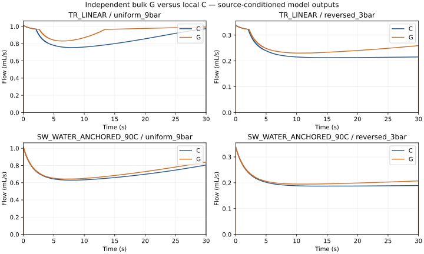
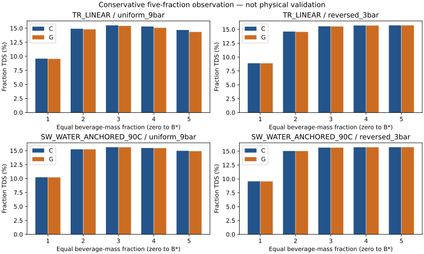

# SCI-MD-RHEOLOGY-005 result

**BULK_STATE_CLOSURE_INSUFFICIENT.** This autonomous pore-volume bulk-state viscosity fails both hydraulic approximation budgets in every law/scenario pair. TR_LINEAR/uniform_9bar additionally fails both aggregate-delivery budgets. The other three pairs pass the selected delivery budgets. All 16 decisions are numerically qualified; none is unresolved.

G uses its own accepted beginning-of-step dissolved storage, not C states, resistance, discharge or fitted targets. It solves native pressure and advances conservative transport/extraction/inventory independently. C remains a computational reference, not experimental truth.

## Primary results

Values ± empirical numerical allowance. Relative metrics are shown in percent; D_TDS is percentage points. Budgets are strict upper bounds: 1%, 2%, 1%, 0.10 pp respectively. Each allowance is below 20% of its budget. These are empirical estimates, not statistical confidence intervals or rigorous PDE bounds.

| Law / scenario | E_Qint ± u (%) | E_Qpeak ± u (%) | E_Spath ± u (%) | D_TDS ± u (pp) | Qualified outcome |
|---|---:|---:|---:|---:|---|
| SW_WATER_ANCHORED_90C/reversed_3bar | 4.579238 ± 0.158528 | 9.410593 ± 0.177686 | 0.072846 ± 0.000344 | 0.024704 ± 0.000103 | Hydraulics fail; delivery passes |
| SW_WATER_ANCHORED_90C/uniform_9bar | 3.175282 ± 0.011969 | 4.724957 ± 0.015313 | 0.197282 ± 0.000329 | 0.073564 ± 0.000202 | Hydraulics fail; delivery passes |
| TR_LINEAR/reversed_3bar | 9.468661 ± 0.178442 | 20.427995 ± 0.224831 | 0.175259 ± 0.001163 | 0.061579 ± 0.000318 | Hydraulics fail; delivery passes |
| TR_LINEAR/uniform_9bar | 10.692809 ± 0.024059 | 22.868158 ± 0.054072 | 1.200049 ± 0.000494 | 0.353827 ± 0.001062 | All four fail |

No score-driven adjustment or retry occurred. This rejects this specific parameter-free closure under the stated budgets; it does not prove that all scalar closures fail or that physical espresso requires local viscosity.

## Coverage and secondary outputs

Common support was established before discrepancies using all required C/G sets and capped at inherited 004 support. Both scenarios retain exactly 100% coverage, exceeding the 95% guard: uniform_9bar B*=23.658382893039853 g; reversed_3bar B*=6.681617998051428 g. No extrapolation or historical 004 reclassification. B is modeled outlet water plus solute, not validated scale mass.

| Law / scenario | Time G / C to B* (s) | Signed fraction TDS G−C, fractions 1–5 (pp) |
|---|---:|---|
| SW_WATER_ANCHORED_90C/reversed_3bar | 28.677708 / 29.988768 | -0.015884, -0.024704, -0.008967, -0.002194, -0.000463 |
| SW_WATER_ANCHORED_90C/uniform_9bar | 29.207482 / 29.997592 | -0.010967, -0.015129, -0.010198, -0.031315, -0.073564 |
| TR_LINEAR/reversed_3bar | 23.849876 / 25.773302 | -0.019208, -0.061579, -0.030292, -0.009706, -0.002697 |
| TR_LINEAR/uniform_9bar | 22.771888 / 25.316160 | -0.049379, -0.109390, -0.094972, -0.232313, -0.353827 |

First fraction is included. TDS at zero mass is undefined. Fixed-time values below are a separate prediction from matched-beverage outputs. No matched-water diagnostic enters 005 decisions.

| Law / scenario | Arm | Water / solute / beverage at 30 s (g) | Stored / remaining solute (g) | Inlet solute loss (g) |
|---|---|---:|---:|---:|
| SW_WATER_ANCHORED_90C/reversed_3bar | C | 5.725889 / 0.958164 / 6.684052 | 1.414439 / 3.222440 | 0.004957389 |
| SW_WATER_ANCHORED_90C/reversed_3bar | G | 5.988091 / 1.006242 / 6.994333 | 1.396473 / 3.192426 | 0.004858097 |
| SW_WATER_ANCHORED_90C/uniform_9bar | C | 20.274316 / 3.386257 / 23.660573 | 0.618451 / 1.593574 | 0.001718313 |
| SW_WATER_ANCHORED_90C/uniform_9bar | G | 20.918083 / 3.486219 / 24.404302 | 0.584558 / 1.527530 | 0.001692947 |
| TR_LINEAR/reversed_3bar | C | 6.616598 / 1.105021 / 7.721618 | 1.369438 / 3.121245 | 0.004296441 |
| TR_LINEAR/reversed_3bar | G | 7.243101 / 1.219909 / 8.463010 | 1.326180 / 3.049791 | 0.004120324 |
| TR_LINEAR/uniform_9bar | C | 24.644247 / 3.975612 / 28.619859 | 0.434908 / 1.188041 | 0.001438826 |
| TR_LINEAR/uniform_9bar | G | 27.279095 / 4.269621 / 31.548716 | 0.365346 / 0.963696 | 0.001335938 |

## Numerical contributions

Temporal, spatial and property terms are absolute changes of paired metrics, so C/G refinement effects appear once. The observer arithmetic term compares float64 and long double. Complete native intervals require no sparse quadrature allowance. TR property contribution is zero because its accepted piecewise-linear representation is exact; SW uses its accepted refined table.

| Law / scenario | Metric | Temporal | Spatial | Property | Arithmetic | Operator | Total u |
|---|---|---:|---:|---:|---:|---:|---:|
| SW_WATER_ANCHORED_90C/reversed_3bar | D_TDS | 0.000101570888 | 1.46479521e-06 | 7.98893129e-08 | 3.83373888e-15 | 0 | 0.000103115573 |
| SW_WATER_ANCHORED_90C/reversed_3bar | E_Qint | 1.14528205e-05 | 8.79397942e-05 | 5.91621817e-07 | 0 | 0.00148529666 | 0.00158528089 |
| SW_WATER_ANCHORED_90C/reversed_3bar | E_Qpeak | 1.32892338e-05 | 0.000195180752 | 1.21831282e-06 | 0 | 0.00156716792 | 0.00177685622 |
| SW_WATER_ANCHORED_90C/reversed_3bar | E_Spath | 3.3567751e-06 | 7.90194654e-08 | 6.95798321e-09 | 7.42678488e-17 | 0 | 3.44275255e-06 |
| SW_WATER_ANCHORED_90C/uniform_9bar | D_TDS | 0.000113118849 | 8.89237812e-05 | 1.6555428e-07 | 1.31145095e-14 | 0 | 0.000202208184 |
| SW_WATER_ANCHORED_90C/uniform_9bar | E_Qint | 2.10233109e-05 | 9.81315144e-05 | 3.89706293e-08 | 0 | 4.99965633e-07 | 0.000119693762 |
| SW_WATER_ANCHORED_90C/uniform_9bar | E_Qpeak | 3.52918419e-05 | 0.00011597291 | 1.23574186e-06 | 0 | 6.31779364e-07 | 0.000153132274 |
| SW_WATER_ANCHORED_90C/uniform_9bar | E_Spath | 2.48608579e-06 | 8.03750052e-07 | 2.69108515e-09 | 7.15573434e-17 | 0 | 3.29252693e-06 |
| TR_LINEAR/reversed_3bar | D_TDS | 0.000254868746 | 6.36056215e-05 | 0 | 9.57567359e-16 | 0 | 0.000318474368 |
| TR_LINEAR/reversed_3bar | E_Qint | 1.53016101e-05 | 0.000211169401 | 0 | 1.38777878e-17 | 0.00155795267 | 0.00178442368 |
| TR_LINEAR/reversed_3bar | E_Qpeak | 4.85554144e-05 | 0.00046996314 | 0 | 0 | 0.00172978707 | 0.00224830562 |
| TR_LINEAR/reversed_3bar | E_Spath | 1.01255272e-05 | 1.50872789e-06 | 0 | 5.70290343e-17 | 0 | 1.16342551e-05 |
| TR_LINEAR/uniform_9bar | D_TDS | 0.000376346255 | 0.000685743839 | 0 | 9.32587341e-15 | 0 | 0.00106209009 |
| TR_LINEAR/uniform_9bar | E_Qint | 6.4943618e-05 | 0.000175202933 | 0 | 2.77555756e-17 | 4.4604328e-07 | 0.000240592595 |
| TR_LINEAR/uniform_9bar | E_Qpeak | 0.000185236929 | 0.000354875537 | 0 | 0 | 6.04197176e-07 | 0.000540716663 |
| TR_LINEAR/uniform_9bar | E_Spath | 2.11790587e-06 | 2.8239954e-06 | 0 | 9.02056208e-17 | 0 | 4.94190127e-06 |

This table uses dimensionless relative units for E metrics and pp for D_TDS. Hydraulic operator envelopes use applied continuum coefficients in each arm; denominator propagation accounts for C error. No hydraulic term is assigned to solute delivery.

| Law / scenario | Hydraulic metric | C operator | G operator | C denominator propagation |
|---|---|---:|---:|---:|
| SW_WATER_ANCHORED_90C/reversed_3bar | E_Qint | 0.00071712373 | 0.000735323191 | 3.28497343e-05 |
| SW_WATER_ANCHORED_90C/reversed_3bar | E_Qpeak | 0.000729211679 | 0.000769302579 | 6.8653659e-05 |
| SW_WATER_ANCHORED_90C/uniform_9bar | E_Qint | 4.84546154e-07 | 2.33427112e-11 | 1.53961359e-08 |
| SW_WATER_ANCHORED_90C/uniform_9bar | E_Qpeak | 6.10302649e-07 | 2.3693835e-11 | 2.14530213e-08 |
| TR_LINEAR/reversed_3bar | E_Qint | 0.000720057937 | 0.000769701528 | 6.81932003e-05 |
| TR_LINEAR/reversed_3bar | E_Qpeak | 0.000733161292 | 0.000846793485 | 0.000149832289 |
| TR_LINEAR/uniform_9bar | E_Qint | 4.0290954e-07 | 2.50447904e-11 | 4.3108695e-08 |
| TR_LINEAR/uniform_9bar | E_Qpeak | 4.91785139e-07 | 2.78033531e-11 | 1.12384233e-07 |

## Engineering, provenance and scope

All interval, domain, boundedness and conservation gates pass. Maximum water/solute residuals are 3.04708e-12 / 1.14329e-12 kg against 1e-8 kg; total correction mass is 0 kg against 1e-10 kg. Local accepted concentrations and inventory remain within inherited bounds. METRICS.json retains all set-wise gates, storage, losses and bulk ranges.

23 short native fixtures passed: accepted-baseline absent/off/observe/coupled agreement, constant-law C/G equivalence, analytical pressure, zero extraction, deterministic repeat, MPI and layered refinement. Eleven unsupported native startups were rejected. Short MPI normalized discrepancy was 5.77e-12 (limit 1e-6); deterministic difference was zero. Four full candidate C controls have zero difference in every accepted trace column.

Exactly 18 full 30 s attempts completed: 14 G and four C controls; zero failed and zero recovery attempts. No 002/003/004 campaign was rerun. Reused physical evidence consists of 18 accepted 002 W/C/N histories, eight selected 003 SW C histories and eight 004 SW N histories (34 unique trajectories, 42 law/set/arm references). REUSE.json binds per-artifact identities; N alpha values remain frozen and are never fitted to G. Accepted 004 C/N results remain contextual only; their historical fraction-TDS conclusion is unchanged.

Accepted 004 merge/tree: ab29a805217010f8c441047aaa04e6b4adaca3fe / 3437fa55ea8510cdebfd66c15ec8ac75e3e3fcb6. Analysis-source commit/tree: 2058d0e947ee9eb92c52d64f6165b810f1fb4732 / a6ffb312473b15be43c1571a893b19873ea47c5a. Original 002 science and parser-corrected executables remain distinct; the latter supplied short legacy controls. Candidate executable SHA256: 5cacc9c709361c7d9ef05baa18545058bce9800bc64ae363636d35fcee1be5d8. Source-law audits and table qualifications were reused by identity and candidate evaluator equivalence passed.

Independent pre-scoring audit passed 8b8ea68251d8a90bdb4c597e56d99c134d4b485f after correcting a generated preview/B0 omission, before any full attempt. Original review is retained externally. Execution completion, engineering PASS, source-conditioned admissibility, scientific INSUFFICIENT, final exact-head review and hosted CI are separate statuses. The final review/CI identities are recorded on the focused PR and external closeout.

Both laws retain industrial-extract transfer limitations. TR uses assumed dilute continuation; SW uses a water-anchored source-derived shape with 90 C temperature extrapolation. Pressure and layering change together, so their causal effects are not separated. This is not internal-field equivalence, a lumped extraction model, a speed claim, a physical viscosity measurement, whole-shot transfer, or taste evidence.

**Defaults and the production dependency lock were not changed.** Puckworks remained read-only. PHYSICAL_VALIDATION remains NOT_ESTABLISHED. No default adoption, deletion of C, merge, laboratory work or successor was authorized.

[Protocol](PROTOCOL.md), [metrics and all allowances](METRICS.json), [support](SUPPORT.json), [attempts](RUNS.json), [freeze](FREEZE.json), [independent audit](AUDIT.json), [reproduction](README.md).
