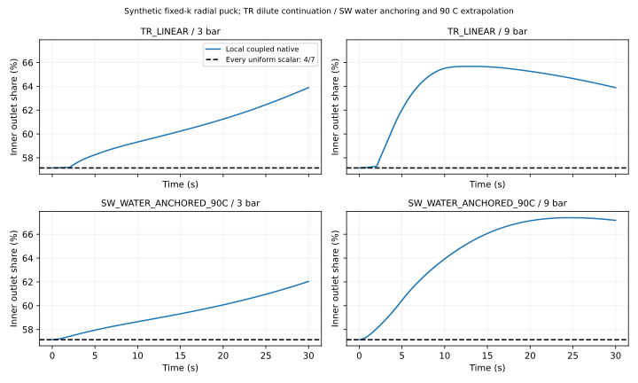
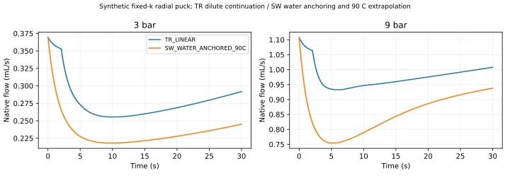
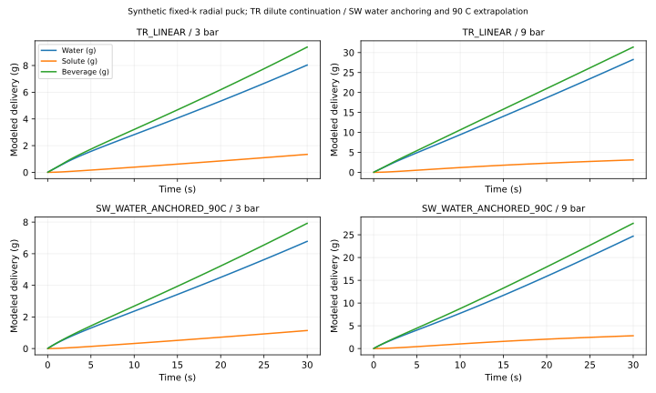
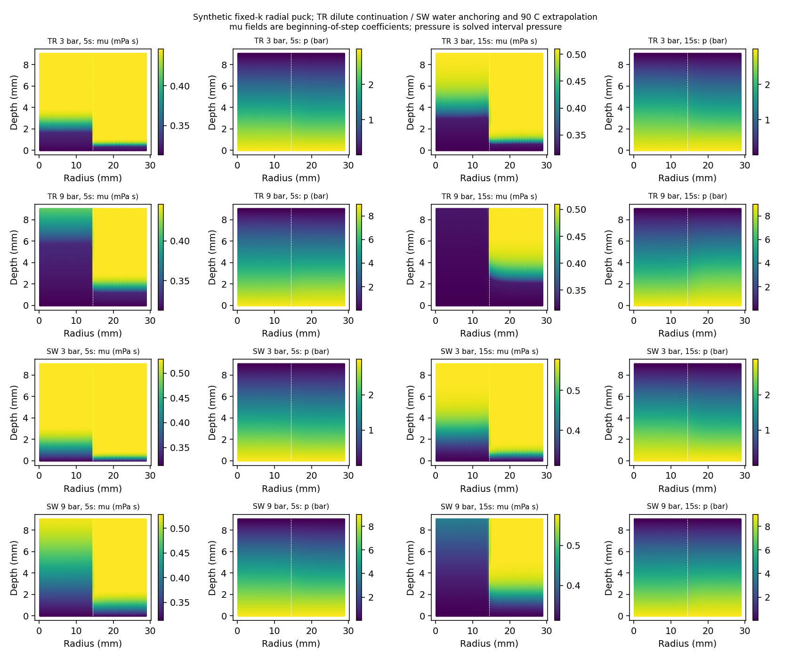

# SCI-MD-RHEOLOGY-006 result

**RADIAL_FLOW_ALLOCATION_MATERIAL. IMPLEMENTED_AND_EXECUTED.** All four synthetic cases have numerically qualified material mean and peak flow-share deviations. At both 3 and 9 bar, both tested source laws support retaining spatial viscosity resolution for these flow-allocation observables at the same fixed permeability field.

A spatially uniform positive scalar viscosity cannot reproduce this allocation: its normalized inner outlet share remains exactly 4/7 under the frozen Darcy boundaries, even if its total flow is matched by an oracle. No scalar closure was fitted or run. This theorem does not compare whole-cup chemistry.

| Law / pressure | D_mean ± u (pp) | D_peak ± u (pp) | Signed cumulative shift (pp) | Case |
|---|---:|---:|---:|---|
| SW_WATER_ANCHORED_90C_3bar | 2.237735 ± 0.009706 | 4.895464 ± 0.019428 | +2.237735 | MATERIAL |
| SW_WATER_ANCHORED_90C_9bar | 7.507251 ± 0.002753 | 10.250477 ± 0.014276 | +7.507251 | MATERIAL |
| TR_LINEAR_3bar | 3.108382 ± 0.013347 | 6.743146 ± 0.022229 | +3.108382 | MATERIAL |
| TR_LINEAR_9bar | 6.684540 ± 0.029866 | 8.539401 ± 0.038546 | +6.684540 | MATERIAL |

All eight metrics satisfy D−u > budget (1 pp mean, 2 pp peak), with u ≤20% of budget. No metric or case is unresolved. These are engineering flow-share screens and empirical sensitivity allowances, not measured espresso variability, confidence intervals or rigorous PDE error bounds. Absolute deviation remains primary; cumulative shifts are toward the inner core in every case. Both laws agree at each pressure, without constituting independent experimental confirmation.

## Numerical qualification

| Case / metric | Temporal | Axial | Radial | Property | Arithmetic | Scalar fixture | Total u (pp) |
|---|---:|---:|---:|---:|---:|---:|---:|
| SW_WATER_ANCHORED_90C_3bar/D_mean_pp | 0.00105677462 | 0.00100035848 | 0.00763425491 | 1.44228208e-05 | 3.99680289e-15 | 2.16086871e-09 | 0.009705813 |
| SW_WATER_ANCHORED_90C_3bar/D_peak_pp | 0.000342232884 | 0.00233253954 | 0.0167310109 | 2.22037614e-05 | 3.55271368e-15 | 2.16086871e-09 | 0.0194279893 |
| SW_WATER_ANCHORED_90C_9bar/D_mean_pp | 0.000360175579 | 0.00238312284 | 2.67733465e-06 | 7.17076583e-06 | 3.55271368e-15 | 2.16086871e-09 | 0.00275314868 |
| SW_WATER_ANCHORED_90C_9bar/D_peak_pp | 0.000961542726 | 0.000639951582 | 0.0126594293 | 1.46719818e-05 | 5.32907052e-15 | 2.16086871e-09 | 0.0142755978 |
| TR_LINEAR_3bar/D_mean_pp | 0.00244505695 | 0.000661631909 | 0.010240156 | 0 | 3.55271368e-15 | 2.16086871e-09 | 0.013346847 |
| TR_LINEAR_3bar/D_peak_pp | 3.01336157e-05 | 0.0014679372 | 0.0207307135 | 0 | 6.21724894e-15 | 2.16086871e-09 | 0.0222287865 |
| TR_LINEAR_9bar/D_mean_pp | 0.0008578126 | 0.00300912649 | 0.0259994694 | 0 | 3.55271368e-15 | 2.16086871e-09 | 0.0298664107 |
| TR_LINEAR_9bar/D_peak_pp | 0.000648318449 | 0.00389938348 | 0.0339987394 | 0 | 8.8817842e-15 | 2.16086871e-09 | 0.0385464435 |

All 22 full runs satisfy conservation and bounds. Maximum water/solute residuals are 2.54337e-12/3.52146e-12 kg; maximum absolute correction mass is 0 kg. Maximum zone-flow sum error is 1.25409e-15 relative; outlet reverse flow is 0. Actual full-basket zone areas/volumes match analytical values within 2.22045e-16/1.10578e-13 relative. Full-dimensional outgoing-face pore Courant reaches 5.66995 across refinements; it is reported as an implicit-transport application diagnostic, not mislabeled as an axial estimate.

TR uses its exact accepted piecewise-linear table, so no property refinement term is imported from SW. SW uses its accepted refined table. Long-double reduction has 64-bit significand precision versus 53-bit float64. The worst scalar-fixture absolute share discrepancy contributes 2.1608687061913656e-9 pp to both metrics. No one-dimensional resistance/operator allowance is reused. All native intervals over 0–30 s are used, including the initial interval; no field-cadence sampling, gaps, interpolation or cropped tail.

Sixteen short native fixtures passed: three meshes × water/double/uniform-k analytical checks, observe/constant-table equivalence, accepted bulk regression, deterministic transverse evolution, exact repeat and radial MPI. Repeat traces are byte-identical; MPI normalized maximum is 4.7943420067309006e-8 (limit 1e-6). The processor interface has 32 radial-normal faces and separates the inner and outer material zones. EXCHANGE.json verifies nonzero native transverse water and upwind solute flux. Sixteen native startup rejections and standalone domain checks completed. An overflowing pressure literal triggered the OpenFOAM parser SIGFPE before the time loop; its initial harness assertion was corrected without rerunning that attempt. The original log is retained.

## Modeled delivery and regional inventory

| Case | Water / solute / beverage at 30 s (g) | Cup aggregate TDS (%) | Inner / outer remaining inventory (g) | Dilute pore occupancy range (%) |
|---|---:|---:|---:|---:|
| SW_WATER_ANCHORED_90C_3bar | 6.781137 / 1.141335 / 7.922472 | 14.406298 | 0.502621 / 2.598389 | 6.5187–100.0000 |
| SW_WATER_ANCHORED_90C_9bar | 24.696792 / 2.816258 / 27.513050 | 10.236079 | 0.057975 / 1.896947 | 19.9254–100.0000 |
| TR_LINEAR_3bar | 8.035605 / 1.345461 / 9.381065 | 14.342301 | 0.414040 / 2.548325 | 8.1543–100.0000 |
| TR_LINEAR_9bar | 28.255274 / 3.114556 / 31.369830 | 9.928507 | 0.048291 / 1.702791 | 24.2676–100.0000 |

Initial regional inventories are 1.4 g inner and 4.2 g outer. Remaining inventory describes depletion in those initial regions. Outlet-region solute delivery is not initial-region provenance because native transverse exchange remains active. Beverage is modeled outlet water plus aggregate solute; no experimental cup benefit or chemistry advantage over an unexecuted scalar alternative is established.

## Execution, provenance and scope

Exactly 22/22 planned full attempts completed: 18 scientific runs and four original-settings uniform/axial C controls. Failed full attempts: 0. Recovery attempts: 0. All legacy CSV schemas/columns agree with accepted 005 controls within the inherited 1e-10 normalized limit (COMPATIBILITY.json). No predecessor campaign was rerun. The original freeze remains immutable. POST_EXECUTION_CORRECTION.json records the reviewed case-decision precedence repair and output-directory handling; every actual score, allowance and case outcome is exactly unchanged, with no native rerun or input/executable change.

Starting accepted 005 merge/tree: db705b644bbc2c3f719690448657e845f2a8f65b / 7acc2aa9777fab3dbe5bedcdee4306920d21675d. Executable SHA256: bea2860f92f4934c3f191b7da8d9c425f73ac254cd42131172dad133dd77d7ad. Freeze SHA256: 7e04ca0a7f923b27cb0a1fc76acc61198495ca1df66871f20b6bfe9ce241deab. RUNS.json binds every actual scenario, interval trace and log. REUSE.json binds accepted tables, source authority and controls. Native run directories, fields, tables, source payloads and build artifacts remain external.

Final independent exact-head G2 review, local repository checks and hosted CI are separate statuses reported on [PR #160](https://github.com/trbrewer/espresso-whole-pull/pull/160). The implementation and numerical evidence above do not self-certify review. Initial local QA failures were environment/manifest/validator integration issues and were corrected in this same lane; original logs are retained.

TR below 10% wet mass fraction is a continuation; SW is water-anchored source-shape adaptation with 90 C temperature extrapolation. Industrial/reconstituted-coffee transfer to espresso remains unqualified. Dilute pore occupancy is not measured-data coverage. Evidence class: SOURCE_CONDITIONED_SYNTHETIC_MODEL_DEVELOPMENT; PHYSICAL_VALIDATION: NOT_ESTABLISHED.

The result supports spatial resolution only for the tested fixed synthetic permeability geometry and flow allocation. It establishes no real-puck viscosity field, channeling onset, instability, evolving-k mechanism, taste or whole-shot improvement. A spatially modified permeability field can mimic mobility; this experiment does not identify viscosity separately from permeability. Accepted 001–005 findings, defaults, production lock and Puckworks are unchanged. Stop at the focused PR handoff: no merge, adoption, new sweep, laboratory work or automatic successor.

[Protocol](PROTOCOL.md) · [Metrics](METRICS.json) · [Run identities](RUNS.json) · [Schema](RADIAL_SCHEMA.json) · [Reproduction](README.md)
