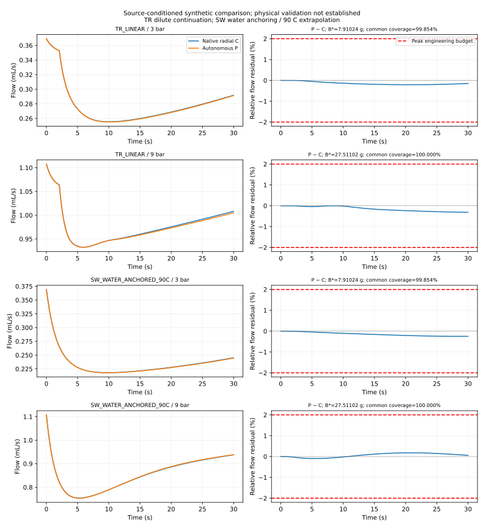
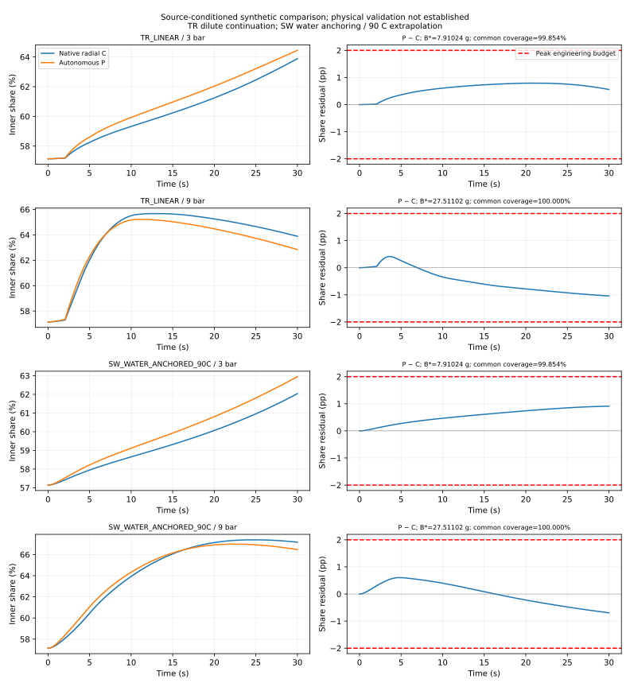
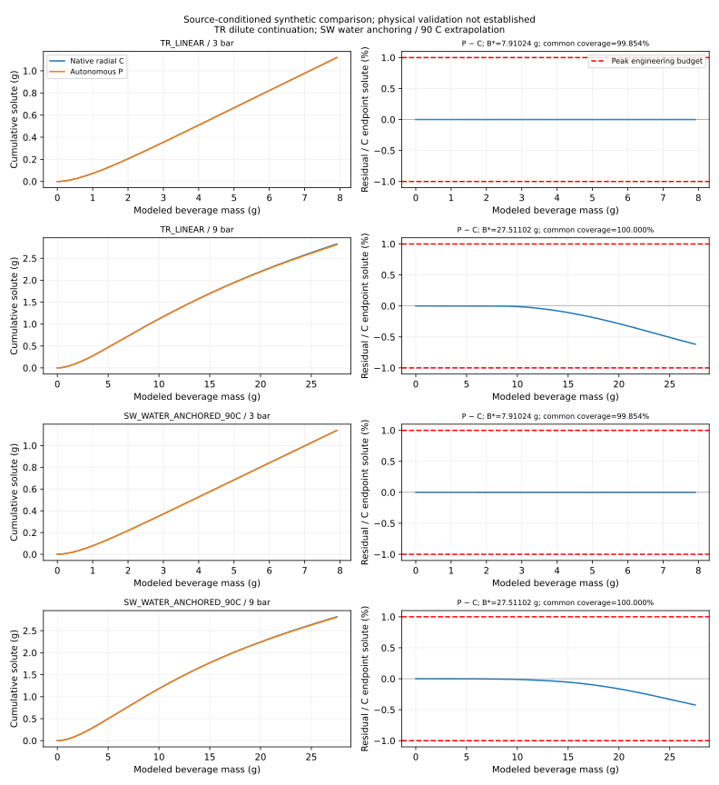
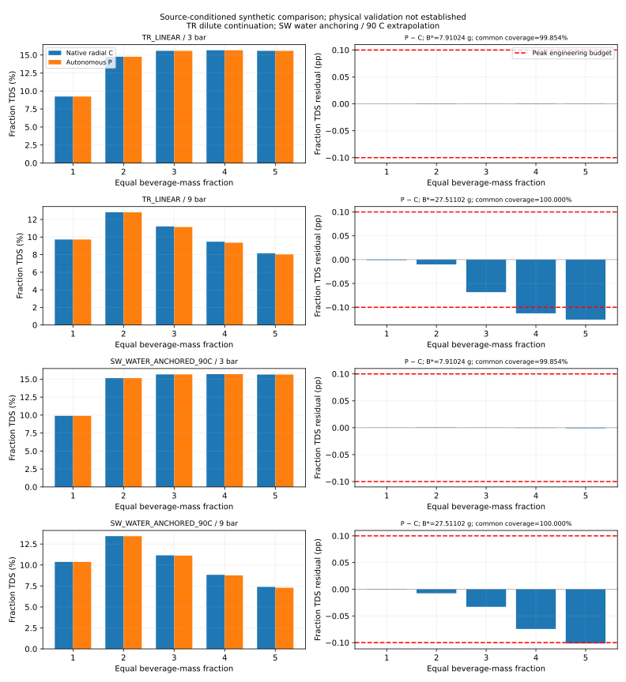

# SCI-MD-RHEOLOGY-007 result

**PARALLEL_PATH_REDUCTION_INSUFFICIENT. IMPLEMENTED_AND_EXECUTED.**

Autonomous P meets the hydraulic and outlet-allocation budgets in all four cases, but TR_LINEAR at 9 bar has a qualified failure of the mass-matched five-fraction TDS budget. SW at 9 bar is unresolved on that same metric. All cumulative-solute path metrics pass. The unresolved sibling does not erase the qualified failure. This rejects sufficiency of this particular non-exchanging construction for all tested outputs; it does not reject all two-path models.

Allocation: **SUFFICIENT_FOR_TESTED_OUTPUTS**. Hydraulics: **SUFFICIENT_FOR_TESTED_OUTPUTS**. Aggregate delivery: **INSUFFICIENT**. At 3 bar all six metrics pass for both laws. At 9 bar both laws pass hydraulics, allocation and cumulative-solute delivery; a shared definitive fraction-TDS verdict across laws is not established.

C is the accepted source-conditioned computational radial reference, not experimental ground truth. P retains two independent native axial states and local viscosity histories. Extensive area weighting is applied once (.25/.75); represented dose is 20 g, initial inventory 5.6 g partitioned 1.4/4.2 g. No parameter was fitted and no evolving C field or history forced P.

## All 24 frozen decisions

Entries are value ± empirical numerical allowance, followed by decision. E_Qint, E_Qpeak and E_Spath are percentages in this table; share and TDS are percentage points. Machine-readable metrics retain fractional units for E metrics. These allowances are observed sensitivities, not confidence intervals or rigorous continuum-error bounds.

| Case | E_Qint (1%) | E_Qpeak (2%) | Share mean (1 pp) | Share peak (2 pp) | E_Spath (1%) | TDS (0.10 pp) |
|---|---:|---:|---:|---:|---:|---:|
| TR_LINEAR_3bar | 0.138053 ± 0.003189 PASS | 0.209218 ± 0.004267 PASS | 0.570194 ± 0.011252 PASS | 0.792561 ± 0.016118 PASS | 0.001347 ± 0.000092 PASS | 0.000645 ± 0.000015 PASS |
| TR_LINEAR_9bar | 0.148246 ± 0.023135 PASS | 0.313912 ± 0.008280 PASS | 0.564381 ± 0.027839 PASS | 1.042254 ± 0.019693 PASS | 0.618448 ± 0.028556 PASS | 0.125818 ± 0.005428 FAIL |
| SW_WATER_ANCHORED_90C_3bar | 0.143603 ± 0.004390 PASS | 0.249784 ± 0.003026 PASS | 0.556717 ± 0.008502 PASS | 0.910072 ± 0.018349 PASS | 0.001247 ± 0.000080 PASS | 0.000896 ± 0.000016 PASS |
| SW_WATER_ANCHORED_90C_9bar | 0.101215 ± 0.003116 PASS | 0.178946 ± 0.005361 PASS | 0.354570 ± 0.009326 PASS | 0.692976 ± 0.023800 PASS | 0.424511 ± 0.039660 PASS | 0.101652 ± 0.006053 UNRESOLVED |

Twenty-two PASS, one FAIL, one UNRESOLVED. Every metric meets u_total ≤20% of budget; the largest allowance is 6.053% of its budget. TR/9 bar fraction-TDS is 0.125818 ±0.005428 pp: its lower edge 0.120390 pp exceeds 0.10 pp. SW/9 bar is 0.101652 ±0.006053 pp and straddles 0.10 pp. P underdelivers TDS in the later mass fractions; TR fractions four and five exceed 0.10 pp at base, with fraction five setting the metric. No smoothing or favorable interval selection.

## Fixed delivery support

| Pressure | B_ref (g) | B_star (g) | Common reference coverage | Coverage across individual C traces |
|---|---:|---:|---:|---:|
| 3 bar | 7.921787280 | 7.910236198 | 99.854186% | 84.321299–99.854186% |
| 9 bar | 27.511021842 | 27.511021842 | 100.000000% | 87.698983–100.000000% |

Both pressures satisfy the frozen ≥95% common-reference support gate. This does **not** mean ≥95% of every individual C shot: coverage reaches only 84.3213% for the longest 3-bar C trace and 87.6990% at 9 bar. Each individual ratio and every required final mass are in [SUPPORT.json](SUPPORT.json), written before discrepancies. Every law and refinement uses the same pressure-specific B_star. Full 0–30 s intervals, including the first, supply hydraulic/allocation metrics. Delivery uses exact splitting of native increments, five equal-B fractions and the union of native mass breakpoints.

## Fresh allowance components

All components below use native metric units (E metrics dimensionless; share/TDS pp). Each paired refinement is counted once; P_base is held for C radial refinement because P has no transverse dynamics, qualified by the area/dimensional fixtures. No 006 scalar or 005 series-operator allowances enter.

| Case / metric | Time | Axial | Radial | Property | Arithmetic | Total |
|---|---:|---:|---:|---:|---:|---:|
| TR_LINEAR_3bar/E_Qint | 1.62819257e-06 | 6.89361863e-06 | 2.33666044e-05 | 0 | 1.73472348e-18 | 3.18884156e-05 |
| TR_LINEAR_3bar/E_Qpeak | 2.96326909e-06 | 9.4430825e-06 | 3.02597687e-05 | 0 | 9.80118764e-17 | 4.26661203e-05 |
| TR_LINEAR_3bar/D_share_mean_pp | 4.12989895e-05 | 0.00097344389 | 0.0102375086 | 0 | 1.11022302e-16 | 0.0112522515 |
| TR_LINEAR_3bar/D_share_peak_pp | 0.000296444712 | 0.00155690717 | 0.0142647876 | 0 | 5.10702591e-15 | 0.0161181394 |
| TR_LINEAR_3bar/E_Spath | 2.03212205e-07 | 2.40899666e-07 | 4.79252139e-07 | 0 | 8.09304406e-16 | 9.23364011e-07 |
| TR_LINEAR_3bar/D_TDS_pp | 7.9198969e-07 | 1.38634723e-06 | 1.28713104e-05 | 0 | 7.75933137e-14 | 1.50496474e-05 |
| TR_LINEAR_9bar/E_Qint | 7.47378836e-07 | 1.28388568e-06 | 0.000229316256 | 0 | 1.51788304e-18 | 0.000231347521 |
| TR_LINEAR_9bar/E_Qpeak | 1.50605016e-06 | 1.85122644e-06 | 7.94417012e-05 | 0 | 1.0495077e-16 | 8.27989778e-05 |
| TR_LINEAR_9bar/D_share_mean_pp | 0.000210038119 | 0.000270622811 | 0.0273586217 | 0 | 2.22044605e-16 | 0.0278392827 |
| TR_LINEAR_9bar/D_share_peak_pp | 0.000171930223 | 0.000853196863 | 0.0186678025 | 0 | 2.44249065e-15 | 0.0196929296 |
| TR_LINEAR_9bar/E_Spath | 7.60662892e-08 | 2.38004314e-06 | 0.000283101448 | 0 | 2.89785557e-15 | 0.000285557558 |
| TR_LINEAR_9bar/D_TDS_pp | 9.36024677e-05 | 7.12741515e-05 | 0.00526303218 | 0 | 7.12485626e-14 | 0.00542790879 |
| SW_WATER_ANCHORED_90C_3bar/E_Qint | 1.07016868e-06 | 4.34887854e-06 | 3.84752382e-05 | 6.7197508e-09 | 1.95156391e-18 | 4.39010052e-05 |
| SW_WATER_ANCHORED_90C_3bar/E_Qpeak | 2.49931896e-06 | 4.86506267e-06 | 2.28618506e-05 | 3.64522249e-08 | 1.36609474e-16 | 3.02626845e-05 |
| SW_WATER_ANCHORED_90C_3bar/D_share_mean_pp | 4.87402833e-05 | 0.00080024106 | 0.00765218273 | 9.03120853e-07 | 2.22044605e-16 | 0.0085020672 |
| SW_WATER_ANCHORED_90C_3bar/D_share_peak_pp | 0.000340270866 | 0.00127496304 | 0.0167310109 | 3.13517954e-06 | 7.77156117e-15 | 0.01834938 |
| SW_WATER_ANCHORED_90C_3bar/E_Spath | 1.22971542e-07 | 1.396412e-07 | 5.41289824e-07 | 1.11133736e-10 | 5.34071214e-16 | 8.040137e-07 |
| SW_WATER_ANCHORED_90C_3bar/D_TDS_pp | 4.8265616e-06 | 5.28073313e-07 | 1.10178783e-05 | 9.54995194e-09 | 9.9824554e-14 | 1.63820633e-05 |
| SW_WATER_ANCHORED_90C_9bar/E_Qint | 3.02690703e-06 | 1.19751401e-06 | 2.69242873e-05 | 6.76845157e-09 | 8.67361738e-19 | 3.11554768e-05 |
| SW_WATER_ANCHORED_90C_9bar/E_Qpeak | 4.03799689e-06 | 2.32050941e-06 | 4.72510055e-05 | 3.86928515e-09 | 7.4376269e-17 | 5.36133811e-05 |
| SW_WATER_ANCHORED_90C_9bar/D_share_mean_pp | 0.000171947008 | 0.000712019172 | 0.00844077561 | 1.19690121e-06 | 2.77555756e-16 | 0.00932593869 |
| SW_WATER_ANCHORED_90C_9bar/D_share_peak_pp | 0.000130426707 | 0.00137911529 | 0.0222864699 | 4.30296938e-06 | 9.2148511e-15 | 0.0238003148 |
| SW_WATER_ANCHORED_90C_9bar/E_Spath | 3.00905912e-06 | 4.68493123e-06 | 0.000388903333 | 4.3398433e-09 | 3.18668703e-15 | 0.000396601663 |
| SW_WATER_ANCHORED_90C_9bar/D_TDS_pp | 0.000126102165 | 1.42990359e-05 | 0.0059120951 | 2.36855371e-08 | 8.11711809e-14 | 0.00605251999 |

Arithmetic was independently recomputed using 50-digit Decimal, including input conversion, weighting, cumulative increments, reference share and mass-boundary interpolation. Maximum discrepancy across the six metrics is below 1.0e-13 in native metric units. The available longdouble also has 64 significand bits (not a float64 alias); Decimal supplies the actual independent audit. TR property contribution is exactly zero for the accepted piecewise-linear representation.

## Qualification and actual execution

All 18 accepted radial science runs were hash-verified and reused, including the separate SW property refinements. Exactly 28 new full native attempts started and completed; zero native solver failures, zero additional full recovery runs, zero bridge runs. Six short native slots completed with no repeats. The ledger preserves **one FAILED post-run QA event**, followed by COMPLETE for that same native attempt after requalification; counts are event counts, not mutually exclusive native outcomes. It is not silently dropped.

The temporal native output directory was `30.000000000002`, inside the inherited endpoint tolerance. A literal `30` field lookup caused the QA failure after native completion. The bounded correction selects exactly one numeric final directory within the existing 1e-9 s tolerance and rejects missing/ambiguous directories. Original freeze and failed file manifest are preserved; no native file changed and no solver reran. [Correction](POST_FREEZE_CORRECTION.json) and [independent delta audit](CORRECTION_AUDIT.json) bind this nonsemantic change. A separately retained synthetic arithmetic test failure was resolved before the freeze by applying the inherited endpoint-roundoff mass floor; it caused no native run or score exposure.

Independent reconstructed constituent water residual ≤1.74e-18 kg and solute residual ≤4.40e-12 kg; every native balance, concentration, inventory, correction, flow-volume and clock gate passed before mixing. Composite balances are independently reconstructed from weighted extensive quantities; [COMPOSITE_ACCOUNTING.json](COMPOSITE_ACCOUNTING.json) retains all 14 compositions, regional masses, volumes and initial inventory. All short area/history comparisons are below 2.73e-11 relative; independent complete-profile audit below 2.97e-11 (limit 1e-6). Maximum full-run radial field nonuniformity is 3.77e-8 (limit 1e-6). Final fields are retained for every new run.

Full native cases use 1,024 cells (base/time/property) or 2,048 cells (axial), totaling 36,864 cells across 28 case meshes; native elapsed execution/qualification sums to 56.868 s. These are descriptive counts/timings, not a performance benchmark. Every invocation, failed event and retained-file manifest is hash-bound by [RUNS.json](RUNS.json) and its external ledger.

## Identities, checks and scientific ceiling

Starting accepted merge `e5b3ef819f9692973f674d5da52511d3b3dad07c`; accepted/result tree `c930fab51b530e20d48efdde9e2bfda4e0cba118`. Live PR #160/#159 and fetched objects agree. Original 007 freeze SHA256 `2417246a1fc8927c7e1844e8e9a63f2f885ab0d6952c29559a05347b9b3b0368`. Exact accepted executable SHA256 `bea2860f92f4934c3f191b7da8d9c425f73ac254cd42131172dad133dd77d7ad`; no rebuild or compatibility bridge.

| Runtime table | SHA256 |
|---|---|
| SW_WATER_ANCHORED_90C_base.table | `f573b330b959c641ef53f7ca14f579cfa12701cb4eb875a68efeef7350540948` |
| SW_WATER_ANCHORED_90C_refined.table | `578de2bd622e06ed14fdee18e22509e410e71b1d21a3516f9877c41d70da8842` |
| TR_LINEAR.table | `c66bb035be1e6126ff4ab713cd08d08852a539392599a46fbd36d15103c1f3f3` |

Analysis Puckworks `2058d0e947ee9eb92c52d64f6165b810f1fb4732` / tree `a6ffb312473b15be43c1571a893b19873ea47c5a`; production lock `fc61c4670ec7bf801e40bb391aab16048b8da26b` remains distinct and unchanged. [REUSE.json](REUSE.json) binds source/table hashes and all C runs. [COMPATIBILITY.json](COMPATIBILITY.json) binds native source/build/executable identities. The audit binds Python/runtime and 21 linked-library hashes; machine paths, restricted sources/tables, binaries, fields and logs remain external.

Independent G1 pre-scoring audit: **PASS**, separate AI reviewer, not human peer review. Bounded directory-lookup delta: **PASS**, unchanged scientific applicability. Software/QA and hosted CI are separate statuses on [PR #162](https://github.com/trbrewer/espresso-whole-pull/pull/162). Twenty-five focused tests pass. Initial static/hosted QA detected the new NumPy test missing from the existing scientific-test allowlist; only its test exemption changed. Initial full-suite bookkeeping failures occurred while README/audit/manifest files were being finalized; original logs are retained and final checks are reported separately on the PR.

P/C disagreement can combine removed lateral pressure communication, transverse advection/diffusion and within-zone radial structure; this task does not separate them. Restricted `transverse_abs_internal_flux_m3_s` was neither repaired nor used as a score, allowance, correction or provenance measure. C outlet-zone solute is not initial-region provenance.

TR dilute continuation and SW water anchoring/90 C extrapolation remain assumptions. Industrial/reconstituted-source transfer to espresso remains unqualified. **PHYSICAL_VALIDATION: NOT_ESTABLISHED.** Passing hydraulic/allocation budgets qualifies this construction against C only in this envelope. No globally minimal model, internal-field equivalence, general portability, measured espresso, taste or default-readiness claim follows. Retain coupling for the failed fraction-delivery observable; no automatic architecture promotion or rescue sweep.

Production source/equations/interfaces/numerical schemes/defaults/lock and Puckworks are unchanged. Accepted 001–006 findings remain intact. Stop at the result/PR handoff: no merge, release, adoption, laboratory action or successor.

[Protocol](PROTOCOL.md) · [Metrics](METRICS.json) · [Support](SUPPORT.json) · [Runs](RUNS.json) · [Reproduction](README.md)
