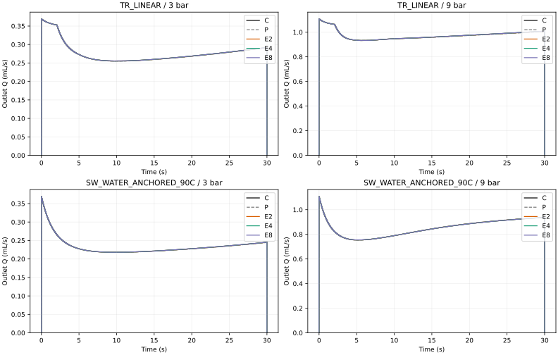
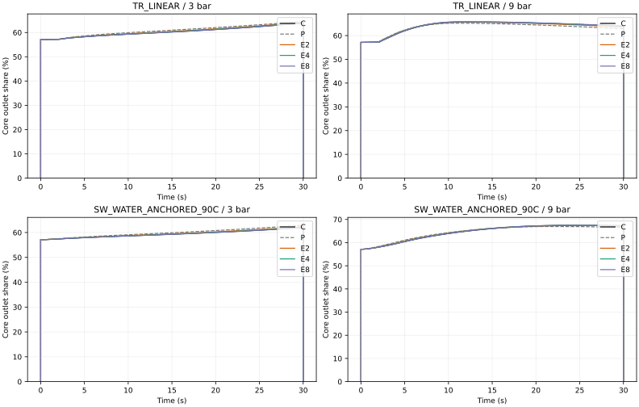
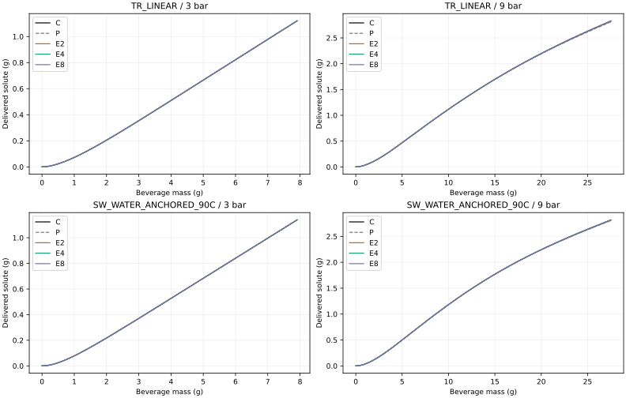
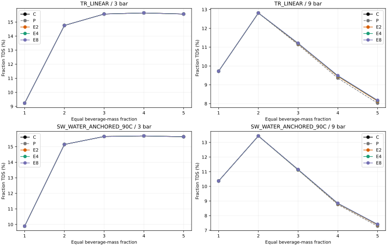

# SCI-MD-RHEOLOGY-008 result

**E2 is COARSEST_QUALIFIED_PASSING_CANDIDATE_AMONG_2_4_8. IMPLEMENTED_AND_EXECUTED.**

All 72 primary decisions PASS: E2, E4 and E8 each pass all 24 hydraulic, outlet-allocation and mass-matched delivery decisions. No candidate or observable is unresolved. E2 is the coarsest passing member of this fixed family in the tested envelope; it is not established as globally minimal or necessary. There is no lower tested unresolved candidate.

C remains the accepted source-conditioned computational reference, not experimental truth. E2 has one native communicating radial cell in the core and one in the annulus per axial station. Native pressure communication, transverse transport and radial state representation remain coupled; the smaller E/C errors do not identify a unique lateral mechanism. No fitted closure or evolving C/P forcing was used.

## Candidate size and disposition

| Candidate | Base/time/property cells | Axial cells | PASS / FAIL / unresolved | Hydraulics | Allocation | Delivery |
|---|---:|---:|---|---|---|---|
| E2 | 1,024 | 2,048 | 24 / 0 / 0 | PASS | PASS | PASS |
| E4 | 2,048 | 4,096 | 24 / 0 / 0 | PASS | PASS | PASS |
| E8 | 4,096 | 8,192 | 24 / 0 / 0 | PASS | PASS | PASS |

C uses 32,768 base cells (512×64), with 65,536-cell axial/radial refinements. Historical P uses two independent 1,024-cell base constituents, with physical weighting once. E totals already include actual areas and annular volumes and receive no additional .25/.75 weighting.

## All 72 decisions

Each entry is value ± fresh total allowance; **every entry is PASS**. E metrics are displayed as percentages here; share/TDS metrics are percentage points. Machine-readable E metrics remain fractions. Strict decisions use unrounded values.

| Candidate / law / bar | Q integral (1%) | Q peak (2%) | Share mean (1 pp) | Share peak (2 pp) | Solute path (1%) | Fraction TDS (0.10 pp) |
|---|---:|---:|---:|---:|---:|---:|
| E2 / TR / 3 | 0.037163 ± 0.002748 | 0.055814 ± 0.004565 | 0.199935 ± 0.010439 | 0.299672 ± 0.018194 | 0.001319 ± 0.000332 | 0.000895 ± 0.000263 |
| E2 / TR / 9 | 0.041848 ± 0.006795 | 0.073751 ± 0.008952 | 0.129618 ± 0.022585 | 0.282969 ± 0.018785 | 0.134198 ± 0.028731 | 0.021250 ± 0.003656 |
| E2 / SW / 3 | 0.039596 ± 0.004032 | 0.057636 ± 0.006152 | 0.170687 ± 0.007868 | 0.311042 ± 0.017333 | 0.000618 ± 0.000116 | 0.000634 ± 0.000022 |
| E2 / SW / 9 | 0.028987 ± 0.002609 | 0.059047 ± 0.004408 | 0.099143 ± 0.005513 | 0.214829 ± 0.011285 | 0.107486 ± 0.036439 | 0.025150 ± 0.005839 |
| E4 / TR / 3 | 0.007445 ± 0.001523 | 0.019841 ± 0.000862 | 0.069716 ± 0.010370 | 0.165761 ± 0.020897 | 0.001628 ± 0.000332 | 0.001009 ± 0.000267 |
| E4 / TR / 9 | 0.012088 ± 0.018056 | 0.051951 ± 0.053621 | 0.062085 ± 0.021188 | 0.150500 ± 0.020132 | 0.025262 ± 0.016513 | 0.013246 ± 0.005327 |
| E4 / SW / 3 | 0.009809 ± 0.001019 | 0.027483 ± 0.001154 | 0.040985 ± 0.007694 | 0.104586 ± 0.016952 | 0.000682 ± 0.000113 | 0.000550 ± 0.000024 |
| E4 / SW / 9 | 0.014648 ± 0.000896 | 0.042616 ± 0.004525 | 0.093462 ± 0.000253 | 0.120299 ± 0.012479 | 0.053637 ± 0.017538 | 0.019907 ± 0.006061 |
| E8 / TR / 3 | 0.021638 ± 0.002282 | 0.040080 ± 0.000300 | 0.029258 ± 0.008107 | 0.047921 ± 0.010225 | 0.001463 ± 0.000312 | 0.000827 ± 0.000258 |
| E8 / TR / 9 | 0.023574 ± 0.028723 | 0.067834 ± 0.055582 | 0.097566 ± 0.026026 | 0.171912 ± 0.023403 | 0.099450 ± 0.028783 | 0.026239 ± 0.005328 |
| E8 / SW / 3 | 0.023937 ± 0.003738 | 0.064805 ± 0.001201 | 0.039352 ± 0.007776 | 0.054212 ± 0.012770 | 0.000718 ± 0.000108 | 0.000440 ± 0.000025 |
| E8 / SW / 9 | 0.013781 ± 0.001536 | 0.030114 ± 0.000355 | 0.061726 ± 0.005406 | 0.149523 ± 0.022589 | 0.074442 ± 0.039763 | 0.028384 ± 0.006041 |

## Fresh numerical allowances and nonmonotonic behavior

All allowances meet u_total ≤20% of the corresponding budget; the largest is 6.061370% of budget. Maximum float/independent 50-digit Decimal discrepancy is 1.82e-14 in native metric units. [METRICS.json](METRICS.json) retains every base/refinement score, arithmetic discrepancy and time/axial/C-radial/property/arithmetic component. TR property contribution is zero for the accepted piecewise-linear law. No E2/E4/E8 difference enters an allowance.

These are empirical numerical sensitivities, not confidence intervals or rigorous continuum-error bounds. Each C radial comparison holds its E candidate fixed. The independent calculation consumes two native radial histories directly and recomputes shares, conservative increments, breakpoints and fraction splits.

Errors are not monotonic with N. At TR/9 bar, fraction-TDS discrepancy is 0.021250, 0.013246 and 0.026239 pp for E2/E4/E8; at SW/9 bar it is 0.025150, 0.019907 and 0.028384 pp. Some hydraulic and cumulative-path discrepancies also increase between candidates. All still pass, without tuning; selection is by the frozen all-output budgets, not minimum observed error.

## Fixed delivery support

| Pressure | Inherited B_star (g, displayed) | Common C coverage | Individual C coverage | Required E terminal mass range (g) |
|---|---:|---:|---:|---:|
| 3 bar | 7.910236198 | 99.854186% | 84.321299–99.854186% | 7.918594780–9.383044199 |
| 9 bar | 27.511021842 | 100.000000% | 87.698983–100.000000% | 27.514356371–31.380984769 |

Exact stored endpoints were imported from 007 before E scores and were never recomputed or reduced. All 42 required E histories reach their pressure endpoint. No extrapolation, extra simulation, favorable crop or changed fraction boundaries occurred. This support is not the whole shot for every C case; individual coverage is as low as 84.321299% at 3 bar and 87.698983% at 9 bar. [SUPPORT.json](SUPPORT.json) retains all individual C coverage; [COVERAGE.json](COVERAGE.json) adds every E terminal mass.

## Qualification, execution and evidence reuse

Exactly **42 full starts, 42 completions, zero native failures, zero full recoveries**. Exactly **12 short native starts/completions**, zero short native failures or correction repeats. There were no new C/P or bridge runs. All 18 accepted C science traces and 28 P constituent traces (14 existing compositions) were hash-verified with required case manifests. P/C regression reproduces all accepted comparison variants.

One short aggregate QA check initially failed by applying relative error to cancellation balance residuals near zero. The largest MPI/serial balance difference was 3.04e-16 kg; both traces passed the inherited absolute 1e-8 kg balance bound. Requalification corrected only that checker and reused all 12 native runs. The original log/preparation and qualification failure are preserved, separately from native attempt counts. Initial binary64 test equality and discovery-import defects are also retained in correction records. The independent audit found a support-edge handling defect and verified its regression-tested correction before any E full start or score. Protocol, matrix, support and thresholds were unchanged.

All native and independent balance, geometry, inventory, concentration, correction, flux-volume and clock gates pass. Maximum independently reconstructed full-run water residual is 5.2e-18 kg; solute residual 4.57e-12 kg. Short analytical Q/share errors are below 5.7e-12 relative; admitted serial/MPI discrepancies are below 7.5e-12 relative.

The generated mesh confirms interface alignment, positive actual annular cell volumes and core/annulus area/volume fractions .25/.75. Final-field volume integrals independently agree with native stored solute and regional/total inventory. The E2 dynamic fixture has oriented native interface water exchange 3.40798394e-10 m3/s and absolute upwind solute exchange 5.52383918e-9 kg/s. This is an advective-only check, not total diffusion-inclusive transport or unique mechanism attribution. The restricted transverse diagnostic is unchanged and excluded.

Final fields are retained for every full run; tolerant numeric-directory selection accepts native floating-point final-time names. [RUNS.json](RUNS.json) binds the durable external invocation ledger and full file manifests. [QUALIFICATION.json](QUALIFICATION.json) and [SHORT_CHECKS.json](SHORT_CHECKS.json) retain gate evidence.

| Candidate | Completed full slots | Observed summed elapsed (s) | Per-slot elapsed range (s) |
|---|---:|---:|---:|
| E2 | 14 | 31.427 | 1.538–2.859 |
| E4 | 14 | 60.204 | 2.887–5.653 |
| E8 | 14 | 131.750 | 6.327–12.222 |

Elapsed times include case preparation, native execution and post-run qualification. They are descriptive observations, not a controlled benchmark or a benchmarked speedup claim. No benchmark campaign was run.

## Accepted baseline, identities and limits

P remains **PARALLEL_PATH_REDUCTION_INSUFFICIENT**: its hydraulic/allocation success stands, with TR/9 bar fraction-TDS FAIL and SW/9 bar fraction-TDS unresolved. Its accepted 22 PASS / 1 FAIL / 1 unresolved decisions are unchanged. The E result qualifies this communicating family; it does not reinterpret P as rejecting every reduced model.

Exact accepted executable SHA256: `bea2860f92f4934c3f191b7da8d9c425f73ac254cd42131172dad133dd77d7ad`. Final audited freeze SHA256: `960b2ea57fc939d23ad665ce081cbf174d7ed6bdc969c9c5c9a7436270874e63`. [REUSE.json](REUSE.json), [COMPATIBILITY.json](COMPATIBILITY.json) and [AUDIT.json](AUDIT.json) bind sources, tables, build/runtime identities, 21 library hashes and actual independent review evidence.

Analysis Puckworks `2058d0e947ee9eb92c52d64f6165b810f1fb4732` remains distinct from unchanged production lock `fc61c4670ec7bf801e40bb391aab16048b8da26b`. Source tables, binary, native fields, private paths and complete logs remain external. Production solver/equations/operators/interfaces/defaults, case generator, native schemes/tolerances, dependency lock and accepted historical task files are unchanged.

Independent pre-scoring audit: **PASS**, separate AI reviewer, not human peer review. Nineteen focused 008 tests and 50 reused/focused audit tests pass. Local initial full-suite environment/bookkeeping failures and corrected reruns are reported in CHECKS.json; final hosted CI and ordinary PR review remain separate statuses on the PR. No additional scientific review ladder.

TR dilute continuation, SW water anchoring/90 C extrapolation and industrial/reconstituted-source transfer caveats remain. No internal-field equivalence, fresh-espresso validation, taste prediction, universal portability or default-readiness is established. **PHYSICAL_VALIDATION: NOT_ESTABLISHED.** Stop at the result and reviewable PR; no merge, promotion, release, laboratory work or automatic successor.

[Protocol](PROTOCOL.md) · [Metrics](METRICS.json) · [Reproduction](README.md)
