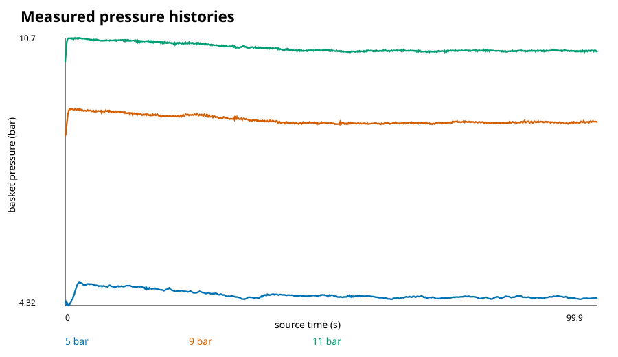
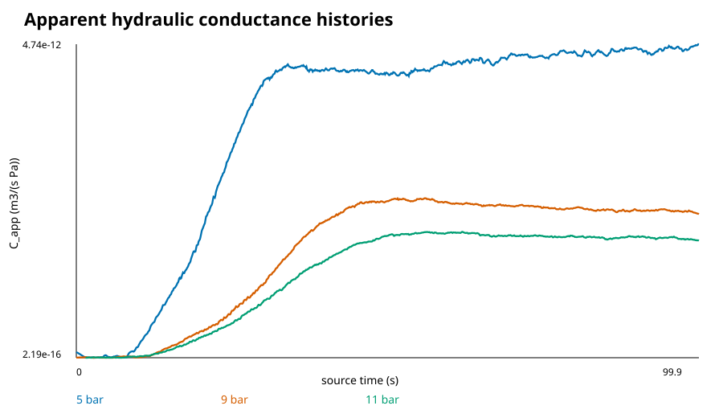
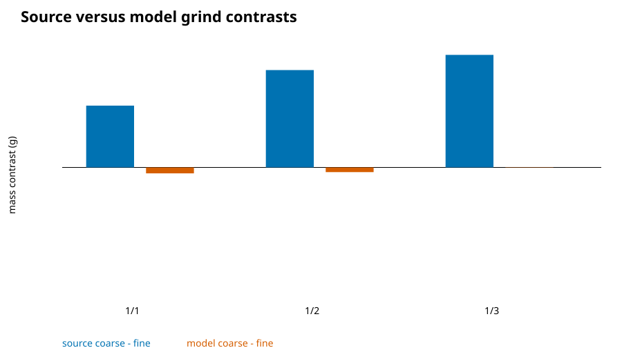
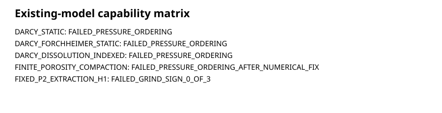
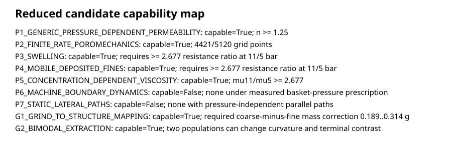
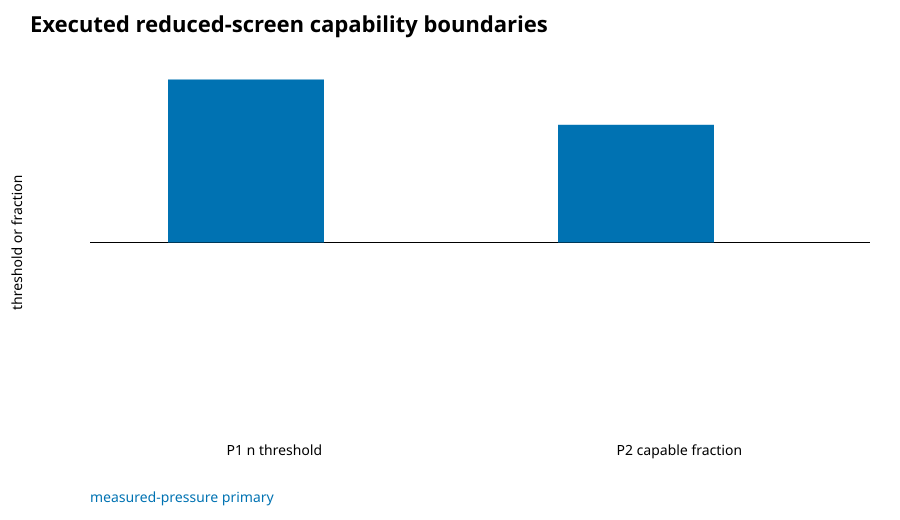
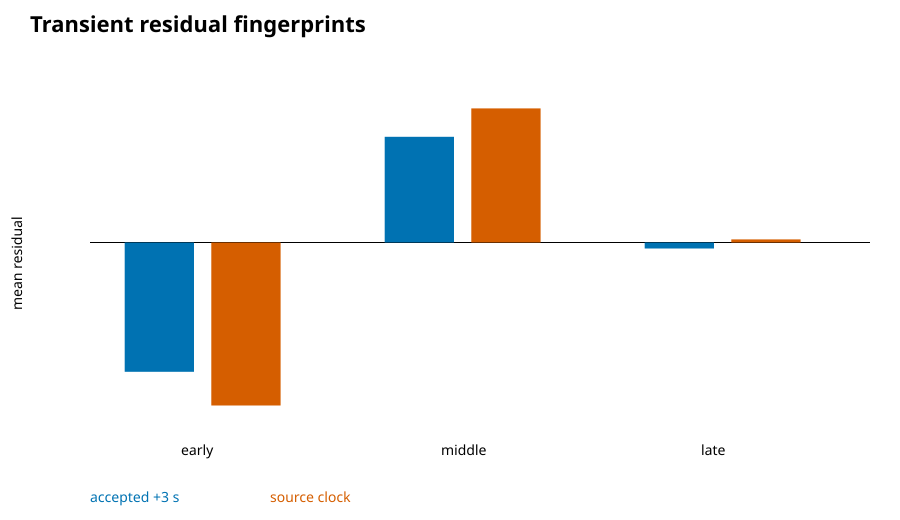

# SCI-MD-001 pressure/grind mechanism-discrimination result

Status: `CORRECTED_PENDING_EXACT_HEAD_REVIEW`

The original result-data commit/tree was
`a0f27d8ef65c618ed202fced8a9c980edbe803aa` /
`f7ed1b495245979ca1dc1dc176bbe63d0d0a40aa`. Review retained the core
scientific result but required correction of taxonomy, pressure basis,
false-green capability fields, and figures. The original protocol remains
visible; the post-freeze correction is not represented as prospective.

## 1. Plain-language executive result

The exposed Waszkiewicz traces require the puck-plus-correctly-defined
boundary system to become substantially *less* conductive as pressure rises.
At the terminal samples, apparent conductance at 11 bar is `0.373506` of that
at 5 bar. The primary invariant is an equivalent
`C_app proportional to p^-1.174` terminal requirement. Under the retained
fixed-geometry and viscosity convention, it may also be expressed as
`K_app proportional to p^-1.174`. This is not a small scale correction: it is
a state-changing resistance requirement.

No tested current EWP family produces the observed pressure ordering. Fixed
Darcy, fixed-coefficient Darcy--Forchheimer, dissolution-indexed Darcy and the
accepted quasi-static compaction result retain the opposite order. Static
parallel heterogeneity is mathematically monotone. Machine dynamics cannot
explain away the reversal after conditioning on measured basket pressure
unless the source pressure node or an unmeasured dynamic state is wrong.

The Schmieder grind failure also persists under prescribed source hydraulic
histories: the fixed model has 0/3 grind-sign matches. It is therefore not
solely a flow-clock error. A grind-to-structure/inventory error and an
aggregate extraction-closure error remain confounded. A two-population
extraction model can change the sign, but the exposed aggregate cup quantities
cannot identify its fractions and rates.

The executed generic pressure-dependence and relaxing-resistance screens are
mathematically capable. Swelling, fines, structure mapping and bimodal
extraction are only *not structurally excluded*; they were not executed as
mechanism-specific models. None is uniquely or physically identified by the
available observables. The result
therefore recommends `NO_NEW_PRODUCTION_PHYSICS_YET`: obtain the discriminating
observables already specified by VAL-DATA-001, then select between transient
poromechanics, fines, swelling and evolving lateral localization.

## 2. Scientific questions

Arm P asks what resistance evolution is required to recover the source
pressure order. Arm G asks whether the grind sign originates in hydraulics,
structure mapping, kinetics or inventory. Arm T asks whether a mechanism
improves early/middle/late shape without condition-specific retuning.

## 3. Evidence and claim boundaries

Inputs are already exposed, rights-compatible accepted VAL-CORPUS-001/002
reduced products. Their roles remain source measured/derived, fixed
predecessor values and existing OpenFOAM results. This is
`POST_OBSERVATION_MECHANISM_DISCRIMINATION`; it is neither blind nor an
independent validation. Reduced hypotheses are:

```text
REDUCED_DIAGNOSTIC_MODEL
POST_OBSERVATION_MECHANISM_SCREEN
NOT_PRODUCTION_OPENFOAM_PHYSICS
NOT_PHYSICAL_VALIDATION
```

The runtime Puckworks lock remained `fc61c4670ec7bf801e40bb391aab16048b8da26b`
/ tree `1d553e44ee2f7480a5df521560801b478618cc84`. The separately inspected
read-only local remote-tracking evidence identity was `bafafef3bc3c77599af8551d4e582aedb9b23f08`
/ tree `64ccf86aff4c90d1c513f1614b39e0823f64d6d7`; it was not refreshed, modified
or executed.

## 4. Source observations

Terminal source flow is `2.056292`, `1.827218`, and `1.777572 g/s` at the
5-, 9- and 11-bar source groups. Corresponding terminal measured basket
pressures are `4.500962`, `8.730249`, and `10.417174 bar`. Source accumulated
mass has the same 5 > 9 > 11 order. Every tested current family orders model
flow and mass 11 > 9 > 5.



## 5. Inverse hydraulic requirement

Using `rho=965 kg/m3`, `C_app=Q/delta_p`, `R_app=delta_p/Q`, and the existing
Darcy geometry/property convention, the terminal conductance ratios are:

| Ratio | Value |
|---|---:|
| 9/5 | 0.458125 |
| 11/9 | 0.815293 |
| 11/5 | 0.373506 |

Middle-, late-, and terminal-window `C11/C5` ratios are respectively
`0.389226`, `0.395294`, and `0.373506`, equivalent to resistance increases of
`2.569`, `2.530`, and `2.677`. The requirement therefore persists across
substantial windows and is not a terminal-sample artifact.

The terminal pairwise required apparent-conductance power-law exponents are
1.178 (5-to-9), 1.156 (9-to-11) and 1.174 (5-to-11). Changing density from
965 to 997 or 1000 kg/m3 rescales
absolute volumetric conductance/permeability but cannot change these ratios or
ordering. The complete early/middle/late/terminal table is in
`SCI_MD_001_INVERSE_REQUIREMENT.json`.



## 6. Grind-response decomposition

The predecessor's coarse-minus-fine source contrasts are `+0.171993`,
`+0.270960`, and `+0.313383 g` at brew ratios 1:1, 1:2 and 1:3. Fixed P2/H1
predicts `-0.016553`, `-0.013064`, and `-0.000837 g`. Thus the equivalent
fine-minus-coarse comparison also fails 0/3, without changing the subtraction
convention. Minimum single-output corrections vary from 0.189 to 0.314 g, so
one common additive adjustment is not consistent across all ratios.

Because H1 prescribes source hydraulics and still fails, hydraulic target
coverage is not the sole cause. Structure mapping, extractable inventory and
one-rate extraction kinetics remain mixed. Species progression already shows
information lost by aggregation, but it does not identify a multispecies
mechanism.



## 7. Current-family capability matrix

| Family | Pressure sign/order | Grind sign | Disposition |
|---|---|---|---|
| Static Darcy | fail | unassessed | structurally monotone with fixed K |
| Static Darcy--Forchheimer | fail | unassessed | positive fixed resistance remains monotone |
| Dissolution-indexed Darcy | fail | unassessed | retained evolution has wrong cross-condition order |
| Accepted quasi-static compaction | fail | unassessed | numerically recovered branch still reverses order |
| Fixed P2 extraction under H1 | unassessed | 0/3 | aggregate grind response fails |

Axial/radial static resistance and existing machine coupling compose only
within explicit solver restrictions recorded in the model inventory. Static
heterogeneity cannot reverse global monotonicity. Current quasi-static
compaction is not capable within its accepted source-linked parameterization;
the available evidence does not establish a broader physically plausible
capability region.



## 8. Reduced candidate-mechanism results

The deterministic execution comprises exactly 301 P1 grid states and 5,120 P2
grid states, totaling 5,421 parameter states. The remaining seven candidates
are analytical or structural checks, not additional parameter ensembles.
Base-2 low-discrepancy sampling and adaptive refinement promised by the frozen
protocol were not executed; the correction records that deviation and
downgrades unexecuted candidates rather than adding post-result model work.

- P1 generic pressure-dependent permeability is capable for approximately
  `n >= 1.18` on the declared grid, but merely restates the required behavior.
- P2 is a one-state exponential relaxing-resistance surrogate, now named
  `P2_RELAXING_RESISTANCE_SURROGATE_POROMECHANICS_MOTIVATED`. It has 4,362
  capable states out of 5,120 under measured terminal pressures. It does not
  solve solid equilibrium, storage, deformation or effective stress. A
  finite-rate resistance state can reproduce the ordering mathematically;
  transient poromechanics is one possible realization, not a demonstrated
  explanation.
- P3 swelling and P4 fines are not structurally excluded, but no
  mechanism-specific magnitude or dynamical model was executed.
- P5 viscosity alone is mathematically capable only through approximately the
  same 2.68-fold property change, outside defensible water-property variation
  here.
- P6 machine dynamics alone is incapable once measured basket pressure is the
  conditioned bed-top node.
- P7 static lateral paths are incapable; pressure-dependent localization or
  communication could remain capable.
- G1 structure mapping and G2 bimodal extraction are not structurally
  excluded, but no executed model demonstrates a 3/3 grind-sign match.



## 9. Confirmatory OpenFOAM results

New OpenFOAM launches: **zero**. Accepted immutable traces already retained
the primitive pressure, flow, mass and residual quantities required for the
current-family adjudication. No reduced survivor had source-supported bounds
sufficient to make a production confirmation distinguish mechanisms rather
than tune a whole-puck case. The frozen confirmatory matrix therefore records
`NO_RUNS_SELECTED`; this is reuse-before-rerun, not a computational failure.
Production solver source is unchanged.

## 10. Physical plausibility

The P1 and P2 executed successful regions are
`CANDIDATE_MECHANISM_CAPABILITY_PLAUSIBILITY_UNRESOLVED`, not outside the
supported range. P3, P4, G1 and G2 are `NOT_STRUCTURALLY_EXCLUDED_NOT_EVALUATED`.
Viscosity-only capability is
`OUTSIDE_SUPPORTED_RANGE`. No candidate reaches
`WITHIN_DIRECTLY_SUPPORTED_RANGE` from the exposed evidence.



## 11. Identifiability and equifinality

`MULTIPLE_MECHANISMS_REMAIN_EQUIFINAL`. Flow alone constrains an effective
resistance trajectory, not its cause. Current practical-identifiability work
already shows that basket pressure helps, deformation separates compaction
parameters, and machine-side pressure separates boundary parameters. Grind
aggregate mass adds too little structure to identify population fractions,
rates, structure mapping and inventory simultaneously.

## 12. Mechanisms ruled out

As standalone explanations within current contracts: pressure-independent
Darcy, fixed-coefficient Darcy--Forchheimer, accepted quasi-static compaction,
static pressure-independent lateral paths, machine dynamics after conditioning
on measured basket pressure, and viscosity-only change within defensible
water-property variation.

## 13. Mechanisms surviving

Generic pressure-dependent resistance and a one-state relaxing-resistance
surrogate are executed mathematical survivors. Swelling, mobile/deposited
fines, pressure-dependent lateral localization, grind-to-structure/inventory
mapping and bimodal extraction remain not structurally excluded but
unevaluated as specific models. None is evidence that a mechanism is physically
present.

## 14. Decisive future measurements

Ranked observations are: (1) synchronized basket pressure, upstream pressure,
flow and bed-height during pressure steps plus release/rebound; (2) turbidity
and captured/retained fines synchronized to resistance change; (3) segmented
outlet flow/spatial extraction; and (4) fractionated or species-resolved
chemistry under prescribed hydraulics and independently measured grinder PSD,
fines, packing and permeability. These extend the existing VAL-DATA-001 plan;
no experiment is commissioned here.

## 15. Recommended next modelling task

`NO_NEW_PRODUCTION_PHYSICS_YET`. The next scientific programme should remain
`XSV-ENS-001`, directly testing whether defensible changes in pore geometry,
compression state, fabric, fines distribution or realization variability can
produce a reproducible 2.5--2.7-fold axial-resistance increase while also
quantifying transverse conductance and inertial closure. The leading
*conditional* production-physics candidate is
`WP04-TPM-001_TRANSIENT_POROMECHANICS`, but it should be selected only after a
pressure-step bed-height/rebound observation can distinguish it from fines and
swelling. If such observations remain unavailable, the next high-value
computational task is `XSV-ENS-001`, because ensemble closure uncertainty can
bound whether the required resistance change is remotely credible without
premature production integration.

## 16. Limitations and prohibited interpretations

The study uses exposed source reconstructions and post-observation diagnostic
screens. It performs no protected scoring, independent holdout, experimental
commissioning or physical validation. A capable reduced equation is not a
validated coffee mechanism; a failed fixed family does not rule out every
possible evolving version of its underlying physics.



```text
PHYSICAL_VALIDATION: NOT_ESTABLISHED
GENERAL_WHOLE_SOLVER_PHYSICAL_VALIDATION: NOT_ESTABLISHED
HOLDOUT_ACQUISITION: NOT_PERFORMED
PROTECTED_SCORING: NOT_PERFORMED
RESULT_CLASS: POST_OBSERVATION_MECHANISM_DISCRIMINATION_AND_REDUCED_DIAGNOSTIC
```
