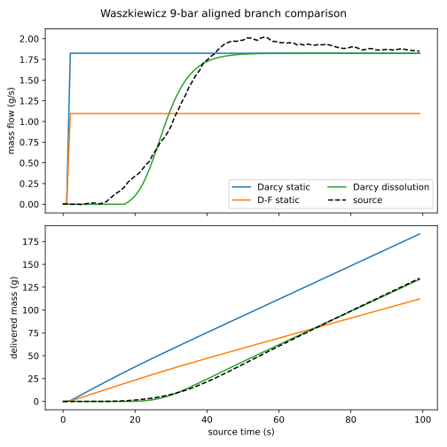
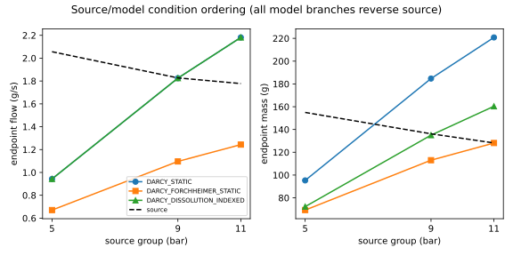
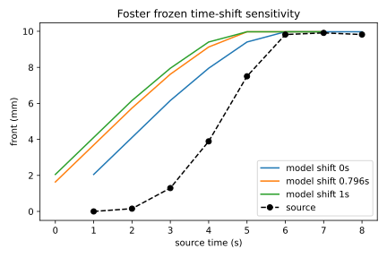

# VAL-CORPUS-001 existing-evidence comparison atlas — corrected v2

**Change declaration:** `NO_GOVERNING_PHYSICS_CHANGE`  
**Scientific disposition:** `ADDITIONAL_DATA_AND_NUMERICAL_ROBUSTNESS_REQUIRED_BEFORE_NEW_PHYSICS`  
**Physical validation:** `NOT_ESTABLISHED`

The exact-head correction preserves the original protocol, bundle, execution
attempts, and three failed compaction traces. It adds a prospectively frozen
13-case matrix executed with the unchanged executable
`0b9a8dd28aae6a2853e287a590162b0088116be9268a6012c037bada9699549c`.
All 13 correction cases completed. Static branches were generated without
`effective_permeability_evolution`; dissolution-indexed branches explicitly
retain it. Waszkiewicz mass uses `965 kg/m3`, and every corrected comparison
uses `solver time = source time + 3 s`, linear interpolation inside the common
domain, and no extrapolation.

## Plain result summary

- **Direction:** every corrected Waszkiewicz branch produces positive flow and
  accumulated mass in the expected within-run direction. Foster's front moves
  downward, and the Mo diagnostic preserves the low-to-high gradient direction.
- **Source condition ordering:** all three Waszkiewicz branch families fail.
  The source orders terminal flow and mass as 5 > 9 > 11 bar, while every model
  family orders them 11 > 9 > 5 bar (`Spearman = -1` for flow and mass).
- **Flow scale:** dissolution-indexed Darcy is locally closest at 9 bar
  (`0.120 g/s` full-window RMSE) and 11 bar (`0.348 g/s`); the remaining
  measured-pressure rows span `0.721–1.118 g/s`. Local scale agreement does not
  repair the failed cross-condition ordering.
- **Accumulated mass:** dissolution-indexed Darcy is locally closest at 9 bar
  (`1.557 g` RMSE), while the measured-pressure rows otherwise span
  `17.554–70.311 g`. No family captures the source ordering.
- **Transient shape:** no Waszkiewicz family captures the full cross-condition
  transient behavior. Foster is partial: late-front agreement is close, but
  early and middle residuals dominate.
- **Assumption-dominated:** Foster timing and DE1 bed depth materially change
  residuals. Mo remains descriptive because coefficient dimensions are
  unresolved.
- **Numerical failure:** the three original finite-porosity compaction attempts
  remain invalidated by nonlinear solver failure. They were not rerun and are a
  separate numerical-robustness finding, not a physical-model verdict.
- **Descriptive only:** original 30-second dissolution-indexed overlap views,
  DE1, Mo, and Wadsworth/Roman component reconstructions do not establish
  transfer validation.

## Corrected Waszkiewicz full-window metrics

All values below use measured source pressure unless the row says nominal.
Pressure, flow, and mass entries are full-window RMSE in bar, g/s, and g.

| Pressure / branch | Pressure | Flow | Mass | Direction | Source ordering | Label |
|---|---:|---:|---:|---|---|---|
| 5 bar / Darcy static | 0.125 | 0.909 | 26.392 | captured | failed | failing |
| 9 bar / Darcy static | 0.115 | 0.863 | 45.751 | captured | failed | failing |
| 11 bar / Darcy static | 0.126 | 1.136 | 70.311 | captured | failed | failing |
| 5 bar / Darcy–Forchheimer static | 0.125 | 1.118 | 39.915 | captured | failed | failing |
| 9 bar / Darcy–Forchheimer static | 0.115 | 0.798 | 17.215 | captured | failed | failing |
| 11 bar / Darcy–Forchheimer static | 0.126 | 0.721 | 22.535 | captured | failed | failing |
| 5 bar / Darcy dissolution-indexed | 0.125 | 0.949 | 42.879 | captured | failed | failing |
| 9 bar / Darcy dissolution-indexed | 0.115 | 0.120 | 1.557 | captured | failed | failing |
| 11 bar / Darcy dissolution-indexed | 0.126 | 0.348 | 17.554 | captured | failed | failing |
| 5 bar / Darcy static, nominal pressure | 0.435 | 0.841 | 21.468 | captured | failed | failing |
| 9 bar / Darcy static, nominal pressure | 0.254 | 0.896 | 49.008 | captured | failed | failing |
| 11 bar / Darcy static, nominal pressure | 0.518 | 1.234 | 77.335 | captured | failed | failing |

Measured-pressure traces reduce pressure RMSE relative to the nominal-pressure
assumption, but do not repair flow or mass ordering. Static and
dissolution-indexed comparisons are condition-dependent: dissolution improves
9- and 11-bar flow and mass scale but worsens 5-bar accumulated mass. The
Darcy–Forchheimer static branch improves 9- and 11-bar mass scale relative to
static Darcy, worsens 5 bar, and also fails ordering.

The original completed Waszkiewicz cases are relabelled
`DISSOLUTION_INDEXED_*_30S` and are scored only on their valid 0–27 s source
overlap. Darcy flow/mass RMSE is `0.593/4.159`, `0.122/0.962`, and
`0.114/0.725` at 5, 9, and 11 bar; Darcy–Forchheimer values are
`0.632/4.323`, `0.185/1.305`, and `0.149/1.135`. These are historical
descriptive overlap views, not corrected full-window transfers.

## Other source and assumption results

| Source / condition | Evidence class | Mode | Calibration inputs | Comparison outputs | Assumptions | Direction | Scale | Shape | Timing | Residual signature | Claim | Failure reason |
|---|---|---|---|---|---|---|---|---|---|---|---|---|
| Foster / shifts 0, 0.796, 1.0 s | post-fit reconstruction | reconstruction | source k and porosity | wetting front | published fitted set; frozen shifts | captured | partial | early/middle fail; late close | assumption-sensitive | RMSE 2.820/3.889/4.153 mm | partial | headspace and first-drip observations not admissibly comparable |
| Wadsworth / Darcy | component | zero-retuning | supplied k | permeability/gradient | one table point | captured | reconstructed | single point | steady | supplied permeability scale reproduced | descriptive | transfer not tested |
| Roman / Darcy | component | zero-retuning | supplied k | permeability/gradient | one table point | captured | reconstructed | single point | steady | supplied permeability scale reproduced | descriptive | transfer not tested |
| Mo low/high / D–F | mechanism diagnostic | reconstruction | digitized apparent k | gradient response | unresolved coefficient units | captured | assumption-dominated | two points | steady | inertial fraction 0.99593/0.99702 | descriptive | coefficient dimensions unresolved |
| DE1 / low 7.5 mm | exploratory within-rig | reconstruction | existing machine fixture | pressure, scale mass | low bed depth | captured | fail | partial | direct | 2.121 bar; 3.726 g RMSE | descriptive | apparatus metadata gap |
| DE1 / base 9.0 mm | exploratory within-rig | reconstruction | existing machine fixture | pressure, scale mass | base bed depth | captured | fail | partial | direct | 2.442 bar; 4.501 g RMSE | descriptive | apparatus metadata gap |
| DE1 / high 10.5 mm | exploratory within-rig | reconstruction | existing machine fixture | pressure, scale mass | high bed depth | captured | fail | partial | direct | 2.693 bar; 6.006 g RMSE | descriptive | apparatus metadata gap |
| Waszkiewicz / finite-porosity compaction | reconstruction | original zero-retuning attempt | none | intended pressure, flow, mass | finite-porosity | unassessed | unassessed | unassessed | stopped | no valid terminal result | invalidated numerical execution | nonlinear fatal error; not rerun |

Foster's zero shift is least discrepant, but all shifts retain large early and
middle residuals; the diagnostic model first-drip time is `5.435 s`, with no
admissible observed event to score. DE1 residuals worsen monotonically from the
low to high bed-depth assumption, so the comparison is assumption-dominated.

## Residual-led interpretation

What works is limited to directional behavior and component reconstruction.
What partly works is local pressure, flow, mass, and late-front scale under
selected conditions. What fails is Waszkiewicz cross-condition ordering and
the original compaction numerical execution. Headspace and observed first
drip are not comparable; DE1 needs bed geometry, pressure-node, supply-curve,
and resistance metadata; Mo needs resolved coefficient dimensions.

Residuals that could later motivate evolving resistance, storage, or machine
control are presently confounded by timing, node, geometry, and apparatus
metadata. No governing-physics increment is justified until those gaps and the
separate compaction numerical-robustness issue are resolved under new
authority.

`GENERAL_WHOLE_SOLVER_PHYSICAL_VALIDATION: NOT_ESTABLISHED`  
`EXPERIMENTAL_COMMISSIONING: NOT_AUTHORIZED`  
`PROTECTED_OR_HOLDOUT_SCORING: NOT_PERFORMED`
