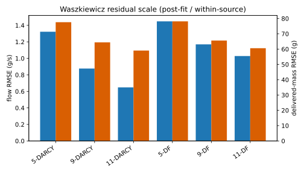
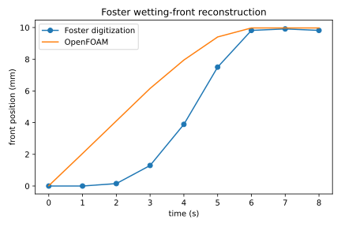
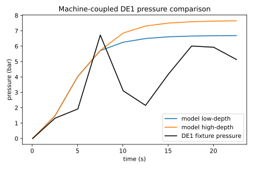

# VAL-CORPUS-001 existing-evidence comparison atlas

**Change declaration:** `NO_GOVERNING_PHYSICS_CHANGE`  
**Scientific disposition:** `ADDITIONAL_DATA_AND_NUMERICAL_ROBUSTNESS_REQUIRED_BEFORE_NEW_PHYSICS`  
**Physical validation:** `NOT_ESTABLISHED`

The frozen campaign attempted 16 declared OpenFOAM conditions using the
unchanged executable `0b9a8dd28aae6a2853e287a590162b0088116be9268a6012c037bada9699549c`.
Thirteen completed. Three compaction cases failed prospectively and are
retained. The external evidence snapshot is commit `9c52c94...`, tree
`44d6539...`; the runtime dependency lock remains unchanged.

## What works, partly works, and fails

- **Works within a component-reconstruction ceiling:** the Wadsworth and
  Roman single-point saturated Darcy fixtures reproduce the supplied
  permeability scale. This is an equation/configuration reconstruction, not
  transfer validation.
- **Partly works:** the Foster front reaches `9.975 mm` versus `9.821 mm` at
  `8 s`, but the trajectory RMSE is `2.659 mm` and the early-time shape is
  different. Direct headspace scoring is not comparable because the solver
  and digitization do not expose the same observable and pressure node.
- **Partly works by direction, fails by accumulated scale:** Waszkiewicz
  Darcy and Darcy–Forchheimer runs preserve positive flow and pressure
  ordering. Flow RMSE is `0.649–1.448 g/s`; delivered-mass RMSE is
  `59.1–78.1 g`. The one-anchor hydraulic scale therefore does not transfer
  to the long-window accumulated mass.
- **Fails numerically:** all 5/9/11-bar finite-porosity compaction runs stop
  with `FOAM FATAL ERROR` from the poroelastic nonlinear solve. No parameters
  were changed and no silent retry was made.
- **Assumption-dominated:** the Mo low/high gradient fixtures give inertial
  pressure fractions `0.99593` and `0.99702`, preserving direction, but the
  source's inertial-permeability dimensions remain unresolved. This cannot
  support coefficient validation.
- **Assumption-dominated and partial:** the DE1 low/high bed-depth ensemble
  produces pressure RMSE `2.120/2.692 bar` and scale-mass RMSE
  `3.726/6.006 g`. Neither assumption closes the residual.

## Per-condition atlas

| Source / condition / branch | Evidence class | Mode | Calibration | Outputs | Assumptions | Direction | Scale | Shape | Timing | Residual signature | Claim | Failure |
|---|---|---|---|---|---|---|---|---|---|---|---|---|
| Waszkiewicz 5 bar / Darcy | reconstruction | one-anchor transfer | 9-bar terminal flow | pressure, flow, mass | base | pass | flow partial; mass fail | partial | origin differs | 1.322 g/s; 77.600 g | partial | — |
| Waszkiewicz 9 bar / Darcy | reconstruction | anchor | permeability | pressure, flow, mass | base | pass | flow partial; mass fail | partial | origin differs | 0.876 g/s; 64.393 g | post-fit | — |
| Waszkiewicz 11 bar / Darcy | reconstruction | one-anchor transfer | 9-bar terminal flow | pressure, flow, mass | base | pass | flow partial; mass fail | partial | origin differs | 0.649 g/s; 59.054 g | partial | — |
| Waszkiewicz 5/9/11 bar / D–F | reconstruction | zero-retuning | none | pressure, flow, mass | Wadsworth closure | pass | mass fail | partial | origin differs | 1.448/1.170/1.028 g/s; 78.143/65.580/60.591 g | partial | — |
| Waszkiewicz 5/9/11 bar / compaction | reconstruction | zero-retuning | none | intended pressure, flow, mass | finite-porosity | unassessed | unassessed | unassessed | stopped | no valid terminal result | invalid | nonlinear fatal error |
| Foster / Darcy wetting | post-fit reconstruction | reconstruction | source k, porosity | front, first drip | published fitted set | pass | partial | partial | partial | 2.659 mm front RMSE | partial | headspace not comparable |
| Wadsworth / Darcy | component | zero-retuning | supplied k | permeability/gradient | one table point | pass | reconstruction | single point | steady | Q=0.00200463 m3/s | reconstruction | — |
| Roman / Darcy | component | zero-retuning | supplied k | permeability/gradient | one table point | pass | reconstruction | single point | steady | Q=4.10990e-6 m3/s | reconstruction | — |
| Mo low/high / D–F | mechanism diagnostic | reconstruction | digitized apparent k | gradient response | unresolved inertial coefficient | pass | dominated | two points | steady | inertial fraction 0.99593/0.99702 | partial | coefficient units unresolved |
| DE1 low/high / machine | exploratory within-rig | reconstruction | existing machine fixture | pressure, scale mass | 7.5/10.5 mm bed | pass | fail | partial | direct time | 2.120/2.692 bar; 3.726/6.006 g | partial | metadata gap |

## Residual-led interpretation

The evidence does not uniquely justify a new governing-physics increment.
Better timing, geometry, pressure-node, supply-curve, and scale-mass metadata
are required. The compaction fatal errors require a separately authorized
solver diagnosis before compaction can participate in evidence comparison.
Possible future evolving resistance, fuller storage, or machine-control work
must be selected only after those numerical and metadata gaps close.

`GENERAL_WHOLE_SOLVER_PHYSICAL_VALIDATION: NOT_ESTABLISHED`  
`EXPERIMENTAL_COMMISSIONING: NOT_AUTHORIZED`  
`PROTECTED_OR_HOLDOUT_SCORING: NOT_PERFORMED`
