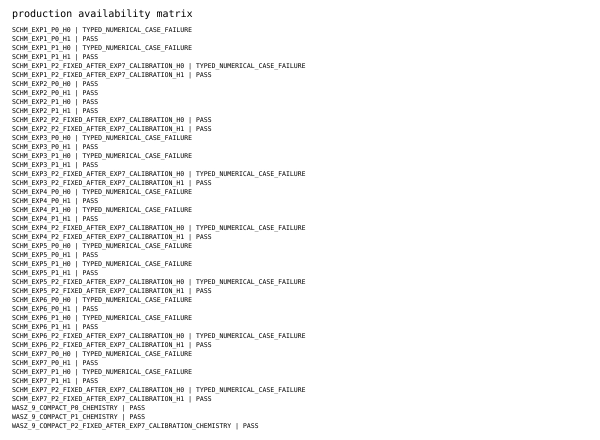
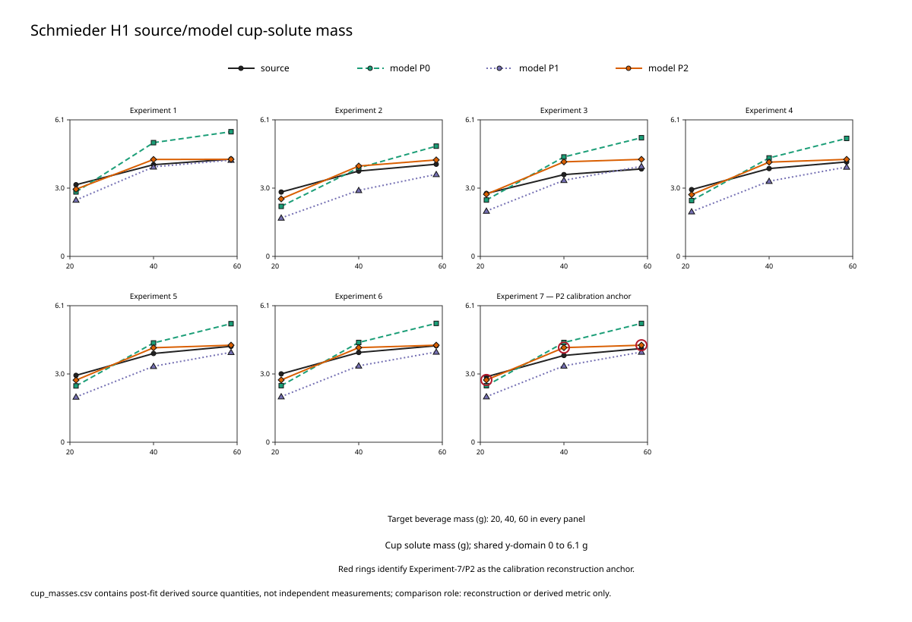
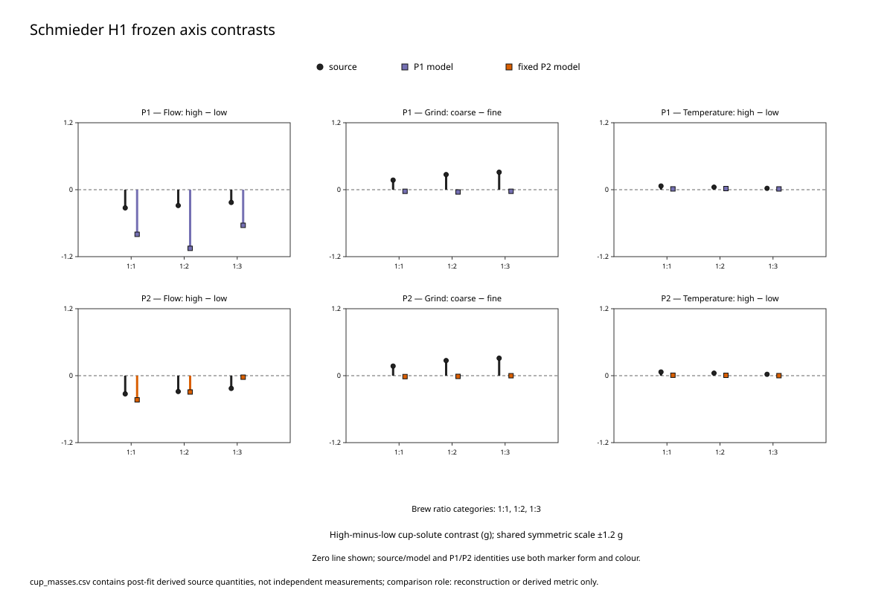
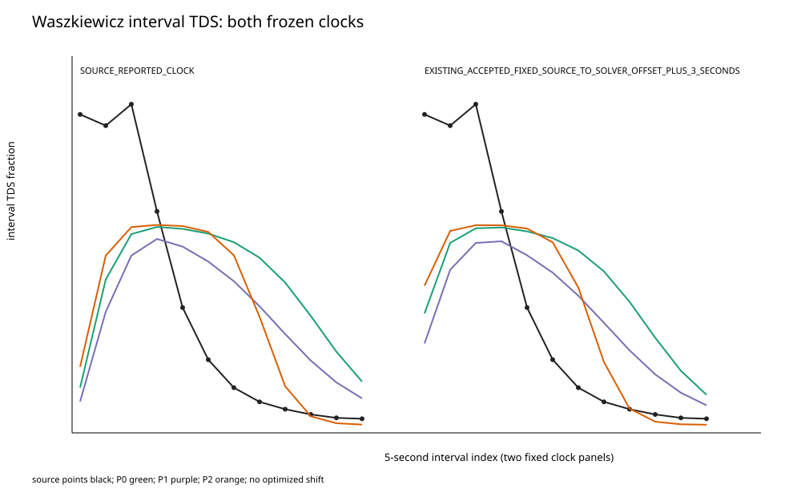
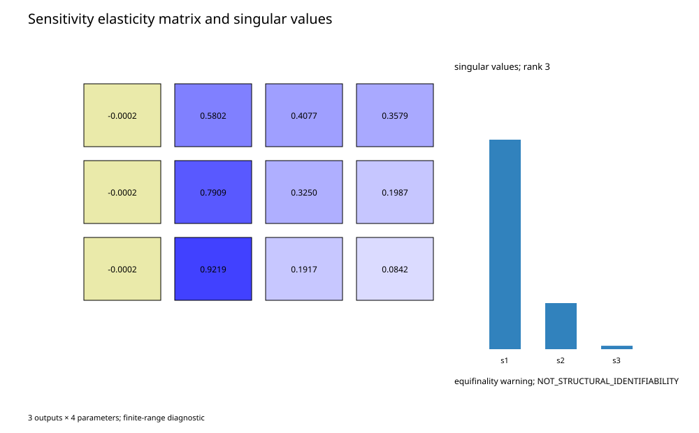

# VAL-CORPUS-002 Stage B2 final result candidate

Status: `RESULT_COMPLETE_PENDING_FINAL_EXACT_HEAD_REVIEW`.

## Execution and availability

The fixed matrix contains 45 production identities. Twenty-seven pass every
applicable numerical gate. Eighteen H0 identities—P0, P1, and fixed P2 for
Experiments 1, 3, 4, 5, 6, and 7—retain the immutable typed disposition
`REQUIRED_TARGET_BEVERAGE_MASS_NOT_REACHED_NO_EXTRAPOLATION`. All 21
Schmieder H1 identities pass target coverage. No missing value is extrapolated,
imputed, excluded, or replaced. Predecessor parity remains 1500/1500 PASS.

The [closed per-case summary](../../validation/cases/val_corpus_002/VAL_CORPUS_002_STAGE_B2_PER_CASE_NUMERICAL_SUMMARY.json)
binds every status, configuration, trace, completion, boundedness,
conservation, bracket, and available target time. Mandatory outputs lacking a
prospectively frozen operator are explicitly
`UNAVAILABLE_OPERATOR_NOT_PROSPECTIVELY_FROZEN`.



## B1 anchor and hydraulic finding

Experiment-7/P2/H1 is a calibration reconstruction, not transfer. Its source
vector `[2.9240100000000004, 3.8761999999999994, 4.187098333333333] g` and
model vector `[2.782144673131987, 4.227214080217558, 4.334636376028199] g`
retain relative-MSE `0.003931989579189616`. P2 is a local reconstruction
coefficient, not identified kinetics.

The 18 H0 target-coverage failures and complete H1 coverage establish
`HYDRAULIC_MISMATCH_MATERIALLY_CONTRIBUTES_TO_TARGET_COVERAGE`. H0 failure is
evidence of hydraulic-clock mismatch. H1 completion does not by itself
establish chemistry accuracy, and error improvement is not uniform across
parameterizations.

## Fixed-parameter Schmieder transfer

For P2/H1, source and model flow-contrast signs match at 3/3 brew ratios and
temperature-contrast signs match at 3/3. Grind signs match at 0/3: the model
reverses the source direction at every brew ratio. Scale transfer is mixed and
incomplete. The Schmieder result is therefore
`PARTIAL_DIRECTIONAL_TRANSFER_ONLY` and `LOCAL_RECONSTRUCTION_ONLY`.





## Waszkiewicz both-clock result

For fixed P2, the frozen +3-second presentation has RMSE
`0.06682489539009928`; the source clock has RMSE `0.08603049216615972`.
Early/middle/late mean residuals are respectively
`[-0.08072143166849205, 0.06597320745689621, -0.0037413913634276215]`
under +3 seconds and
`[-0.10176895108089963, 0.08372607324036582, 0.001955934536179469]`
under the source clock. The fixed presentation improves the descriptive error
but does not validate: `CROSS_SOURCE_TIME_SHAPE_TRANSFER_FAILURE`.



## Sensitivity and equifinality

All nine frozen sensitivity identities pass, with one exact baseline reuse.
The 3-by-4 log-secant matrix has singular values
`[1.4794976052244018, 0.3254758935853393, 0.024204180352591087]` and rank
three under the frozen tolerances. Strong parameter correlations and the
three-output rank ceiling retain the equifinality warning and
`NOT_STRUCTURAL_IDENTIFIABILITY`.



## Source-only normalized species progression

The [source-only audit](../../validation/cases/val_corpus_002/VAL_CORPUS_002_STAGE_B2_NORMALIZED_SPECIES_AUDIT.json)
contains 24 complete replicate triplets per component. Mean normalized
progression at brew ratios 1/1, 1/2, and 1/3 is:

| Component | 1/1 | 1/2 | 1/3 |
|---|---:|---:|---:|
| TDS | 0.7080462873561917 | 0.9300451013015908 | 1.0 |
| trigonelline | 0.7356657104905614 | 0.9419107120748138 | 1.0 |
| 5-CQA | 0.6599169162836315 | 0.9071458316027874 | 1.0 |
| caffeine | 0.6338657391825548 | 0.8929750022861946 | 1.0 |

This demonstrates information loss in an aggregate representation; it does
not grant named-species OpenFOAM authority or identify an aggregate residual's
mechanism.

## Reduced source-clock diagnostic

The [21-row reduced diagnostic](../../validation/cases/val_corpus_002/VAL_CORPUS_002_STAGE_B2_REDUCED_SOURCE_CLOCK.json)
covers Experiments 1–7 and P0/P1/fixed P2 at 20, 40, and 60 g using only the
frozen source flow and analytic first-order expression. Every value is
`DIAGNOSTIC_NOT_OPENFOAM_NOT_VALIDATION`. It omits wetting, pressure solution,
spatial transport, dispersion, saturation ceiling, and finite-volume effects.

## Final dispositions and claim ceiling

```text
SCIENTIFIC_RESULT_DISPOSITION:
  LOCAL_RECONSTRUCTION_ONLY_WITH_PARTIAL_AXIS_DIRECTION_TRANSFER,
  HYDRAULIC_TARGET_COVERAGE_MISMATCH,
  AND_CROSS_SOURCE_TIME_SHAPE_TRANSFER_FAILURE

VALIDATION_FRAMEWORK_DISPOSITION:
  FRAMEWORK_OPERATIONAL_FOR_FAIL_CLOSED_FIXED_PARAMETER_
  AGGREGATE_CHEMISTRY_COMPARISON_WITH_TYPED_AVAILABILITY

PHYSICAL_VALIDATION: NOT_ESTABLISHED
GENERAL_WHOLE_SOLVER_PHYSICAL_VALIDATION: NOT_ESTABLISHED
NEW_GOVERNING_PHYSICS: NOT_AUTHORIZED
```

The framework is operational for fail-closed comparison, not a scientific
success claim. Waszkiewicz time-shape transfer fails despite relative
improvement. No current residual uniquely selects a new governing mechanism.
Future work may ask for independent hydraulic-clock, grind-response, and
species-resolved data, but this result authorizes no mechanism, refit,
protected scoring, VAL-CASE-002 work, or merge.

Calibration is closed with no refit; protected scoring was not performed.
