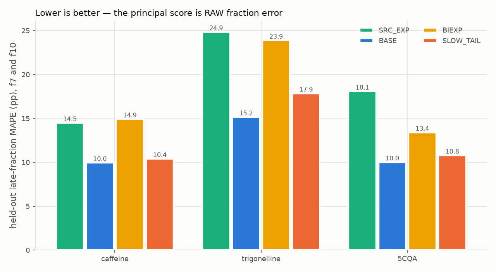
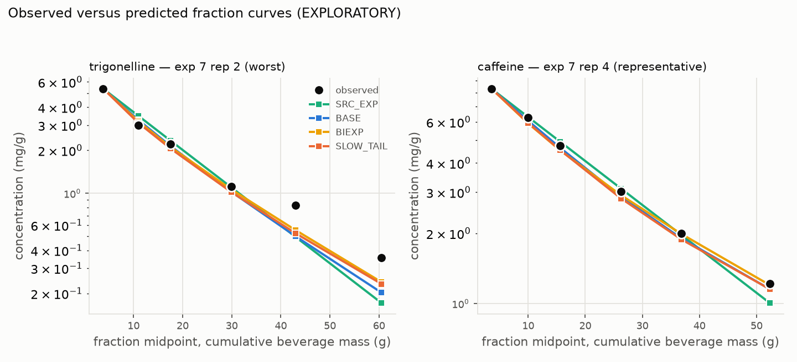
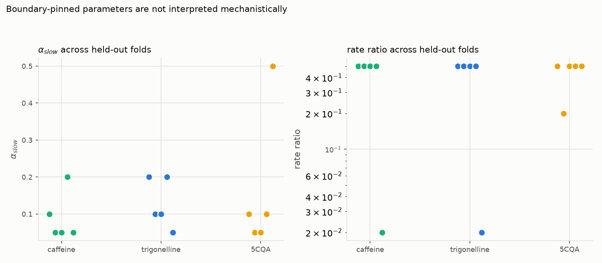
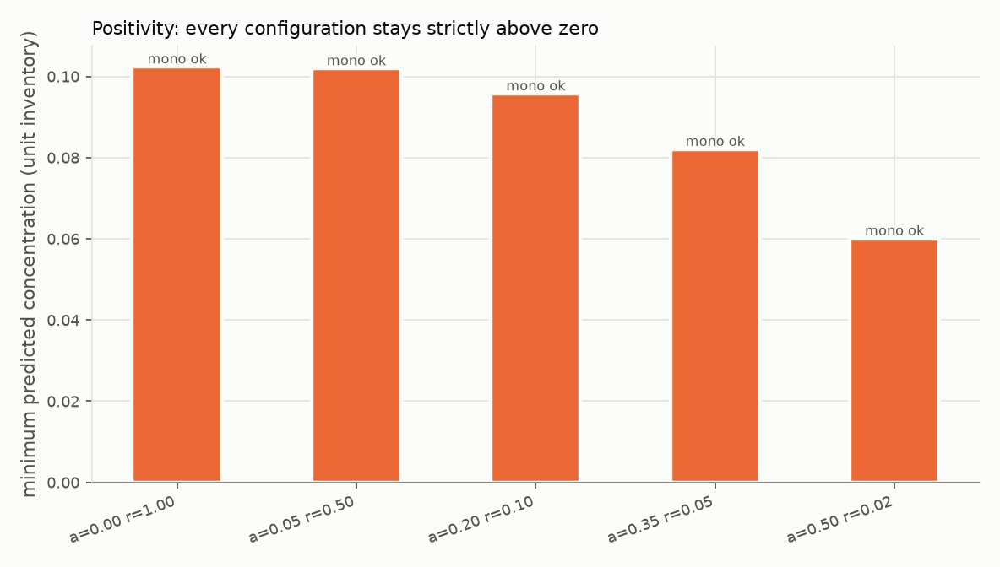
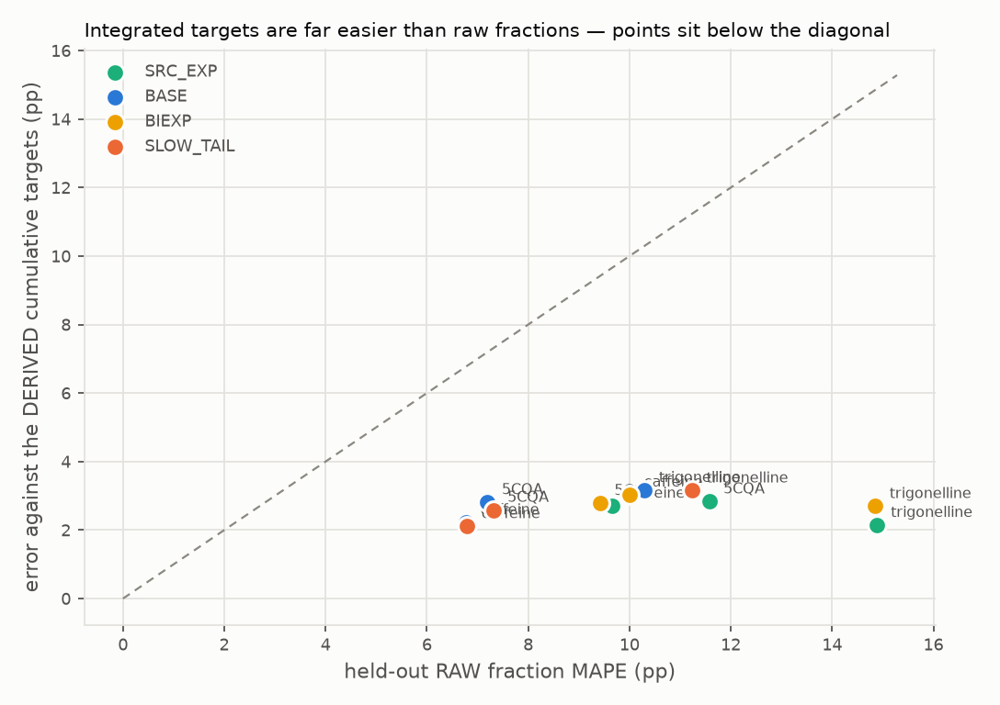

# VAL-PUCKWORKS-001 — BASE temporal cross-validation and cup-mass lineage

## 1. Purpose and disposition

This record imports a bounded Puckworks result into the espressoWholePullFoam
validation programme. It is the persistent local authority for both the
supporting temporal-fraction evidence and the lineage limits of
`cup_masses.csv`.

```text
EVIDENCE_ROLE = CROSS_REPOSITORY_SUPPORTING_EXTRACTION_EVIDENCE
COMPARISON_MODE = LEAVE_ONE_EXPERIMENT_OUT_WITHIN_ONE_SOURCE_CAMPAIGN
PHYSICAL_VALIDATION = NOT_ESTABLISHED
DIRECT_VALIDATION_OF_ESPRESSO_WHOLE_PULL_FOAM = NO
PAPER_1_STATUS = CLOSED_BY_SCIENTIFIC_EVIDENCE
```

No OpenFOAM comparison was run for this integration. Paper 1 is not reopened
or reinterpreted.

## 2. Exact upstream source identity

- repository: `https://github.com/trbrewer/puckworks`
- commit: `21869fe19feec2dce6af8f4a41f63299473e31c2`
- source root:
  `docs/paper1_resource/exploratory/temporal_discrepancy/`
- local source record:
  [`PUCKWORKS_BASE_TEMPORAL_CV_SOURCE_RECORD.json`](../../validation/external/puckworks_base_temporal_cv/PUCKWORKS_BASE_TEMPORAL_CV_SOURCE_RECORD.json)

Every imported member is an exact byte copy. The source record binds upstream
repository, commit, upstream and local paths, both SHA-256 values, byte
identity, evidence status, and claim boundary.

## 3. Evidence unit and cross-validation design

The matched unit is experiment × replicate × solute. The primary set retains
grind level 1.7. It contains 16 shots from five experiments (`1`, `2`, `5`,
`6`, `7`), three solutes (caffeine, trigonelline, and 5-CQA), and fractions
`1`, `2`, `3`, `5`, `7`, and `10`. Fractions `7` and `10` define the late
subset. Each fold holds out an entire experiment, so `n_folds = 5`.

The authoritative row-level source is the imported
[`PAPER_A_TEMPORAL_MATCHED_DATA_MANIFEST_V1.json`](../../validation/external/puckworks_base_temporal_cv/PAPER_A_TEMPORAL_MATCHED_DATA_MANIFEST_V1.json).
It excludes three incomplete shots: experiment 2 replicate 3 and experiment 5
replicate 3 lack fraction 2 solute concentrations; experiment 10 replicate 1
lacks fraction 2 mass fraction and accumulated mass. These exclusions explain
why the retained five-experiment set contains 16 shots.

Primary observations are raw extraction fractions. The cumulative cup metric
is secondary and lineage-derived.

## 4. BASE numerical results

BASE is the current Puckworks two-grain mechanistic extraction solver. Its
cross-fold `kappa` is `1.053357520264539`. All five folds completed for every
solute. The retained BASE comparison reports zero positivity violations and
zero mass-conservation violations.

| Solute | All-fraction MAPE | Late-fraction MAPE | Mean signed late residual | Derived cumulative MAPE | Failed fits |
|---|---:|---:|---:|---:|---:|
| caffeine | 6.8% | 10.0% | +1.6% | 2.2% | 0 |
| trigonelline | 10.3% | 15.2% | -3.5% | 3.2% | 0 |
| 5-CQA | 7.2% | 10.0% | +1.3% | 2.8% | 0 |

Full-precision provenance values are:

| Solute | All-fraction MAPE | Late-fraction MAPE | Mean signed late residual | Derived cumulative MAPE |
|---|---:|---:|---:|---:|
| caffeine | `6.773723008023561%` | `9.956192697201004%` | `+1.5553653242809058%` | `2.2230231547476897%` |
| trigonelline | `10.298791345087212%` | `15.158854455498721%` | `-3.4686832418065188%` | `3.1662156395611976%` |
| 5-CQA | `7.196408617674486%` | `10.016456716398794%` | `+1.3445947506081093%` | `2.8110375983062417%` |

The displayed values are verified directly against
[`PAPER_A_TEMPORAL_MODEL_COMPARISON_V1.json`](../../validation/external/puckworks_base_temporal_cv/PAPER_A_TEMPORAL_MODEL_COMPARISON_V1.json).

## 5. Comparison and interpretation

Within one published machine/coffee/grinder campaign, the existing Puckworks
two-grain extraction solver produced stable leave-one-experiment-out
predictions of raw fraction concentration, with all-fraction MAPE of
approximately 6.8%, 10.3%, and 7.2% for caffeine, trigonelline, and 5-CQA,
respectively. This is useful source-specific cross-validation of an extraction
component, not independent validation of the general whole-pull solver.

This evidence is stronger than a same-data fit or a source-curve
reconstruction. It is weaker than independent cross-machine, cross-coffee,
cross-grinder, or cross-laboratory validation. BASE is a Puckworks extraction
solver result, not an espressoWholePullFoam or other OpenFOAM execution. It
does not repair the Waszkiewicz ordering, Foster, DE1, or other whole-solver
transfer findings recorded in the existing evidence atlas.

`SRC_EXP` is a source-fitted exponential lineage baseline, not a prospective
held-out model. `BIEXP` is the positive two-timescale empirical benchmark, and
`SLOW_TAIL` is BASE with a slow-accessible inventory subpopulation. Those
identities must not be conflated in captions or later summaries.

## 6. Matched-data manifest

The immutable matched-data manifest is not transformed into a new dataset. It
binds the retained shot identities and mass windows, the six measured
fractions, the three source-file hashes, and every exclusion. The imported
manifest remains authoritative for row-level membership; the local source
record only summarizes and content-binds it.

## 7. Figure inventory

The following exact upstream figures are retained. Every caption uses the
evidence unit “held-out experiment within one source campaign” and the claim
ceiling “supporting extraction-component evidence; physical validation not
established.”



*Held-out late-fraction comparison. The held-out unit is the entire experiment
within one campaign. BASE, BIEXP, SLOW_TAIL, and SRC_EXP retain their upstream
model roles; this is not direct validation of espressoWholePullFoam.*



*Observed-versus-predicted raw fraction curves for leave-one-experiment-out
evidence within one campaign. Claim ceiling: supporting extraction-component
evidence; physical validation not established.*



*Cross-fold parameter stability with experiments as held-out units. This does
not establish cross-machine, cross-coffee, or whole-solver transfer.*



*Positivity and mass-conservation checks for the retained Puckworks comparison.
These are numerical checks on supporting extraction evidence, not physical
validation.*

The SHA-256 values are, respectively, `55945eceb05ebc4d449c944a293911dfad6c60b418f808f570397b36c23013dd`,
`4248022df4149fb9b9de5ad3caa6fd69c9e7198bacc4acbd0b412d1991994dbb`,
`2ccd5f82eff60945f83851c42e00520cea9cdfa11197d8f948d2f5239cedf126`,
and `9336facc0d5a09b216904759c3942c70768d56f2f533d512a33096ce1822e778`.

## 8. cup_masses.csv lineage audit

`cup_masses.csv` contains quantities derived from each replicate's fitted
source kinetics. It is not an independent cup-measurement dataset.

The reconstruction is:

```text
mass_in_cup(M) = c0 * lambda * (1 - exp(-M/lambda))
concentration_in_cup(M) = mass_in_cup(M) / M
```

The imported audit reports 432 rows checked, 427 rows within 0.01%, median
relative reconstruction error `3.2238843694444866e-05%`, and zero
concentration `mass/M` mismatches. The five larger deviations correspond to
duplicated/transcription-like published entries. The exact deviations and
duplicate groups are retained in
[`PAPER_A_CUP_TARGET_LINEAGE_AUDIT_V1.json`](../../validation/external/puckworks_base_temporal_cv/PAPER_A_CUP_TARGET_LINEAGE_AUDIT_V1.json).



*Data-lineage diagnostic only. The integrated cup target is derived from
replicate-fitted source kinetics and is not evidence of superior predictive
performance or an independent validation target. SHA-256:
`69ec515c72bbb59c4873396974ea02c6d1b4b8878c1c45da94aa0812255e7717`.*

## 9. Mandatory future-use caveat

Every future local configuration, adapter, comparison record, plot, report,
or manuscript use of `cup_masses.csv` must carry these fields or their exact
semantic equivalent:

```text
evidence_class = POST_FIT_DERIVED_FROM_FITTED_KINETICS
independent_measurement = false
allowed_use = SOURCE_LINEAGE_RECONSTRUCTION_OR_DERIVED_METRIC_ONLY
prohibited_use = INDEPENDENT_VALIDATION_TARGET
required_citation = docs/validation/VAL_PUCKWORKS_001_BASE_TEMPORAL_CROSS_VALIDATION_AND_CUP_MASS_LINEAGE.md
```

The imported matched-data manifest is immutable upstream evidence and is
covered by the adjacent structured local source record. A narrow repository
verifier rejects any other governed JSON reference lacking this declaration.

## 10. Claim ceiling

- `PHYSICAL_VALIDATION: NOT_ESTABLISHED`
- `GENERAL_WHOLE_SOLVER_PHYSICAL_VALIDATION: NOT_ESTABLISHED`
- `DIRECT_VALIDATION_OF_ESPRESSO_WHOLE_PULL_FOAM: NO`
- `NEW_GOVERNING_PHYSICS: NOT_AUTHORIZED`

The derived cumulative target cannot be used as independent validation. This
record does not authorize model fitting, a new comparison, Paper 1 changes, or
an upgrade of the whole-solver claim ceiling.

## 11. Reproduction and integrity

Run:

```bash
python3 scripts/verify_puckworks_base_temporal_cv.py --root .
python3 -m unittest tests.test_puckworks_base_temporal_cv
python3 scripts/verify_source_manifest.py --root .
```

The verifier checks all imported hashes, BASE aggregates and displayed
numbers, matched-data counts and exclusions, lineage fields, figure hashes,
and the narrow future-reference rule. It does not execute Puckworks analysis
or OpenFOAM.

## 12. Consequences for the validation roadmap

The programme now has source-specific cross-validated extraction-component
support in addition to its reconstruction and whole-solver comparison record.
This narrows one evidence gap but does not establish transfer beyond the
single campaign and does not erase adverse hydraulic, wetting, apparatus, or
whole-solver results. Future work should seek materially independent
cross-machine, cross-coffee, cross-grinder, or cross-laboratory evidence before
raising the extraction or whole-solver validation claim.

## Standing instruction for future validation work

Any future comparison, adapter, plot, report, or manuscript text that uses `cup_masses.csv` must
identify it as a post-fit quantity derived from replicate-fitted source kinetics, not as an
independent cup measurement. The required local authority is
`docs/validation/VAL_PUCKWORKS_001_BASE_TEMPORAL_CROSS_VALIDATION_AND_CUP_MASS_LINEAGE.md`.
